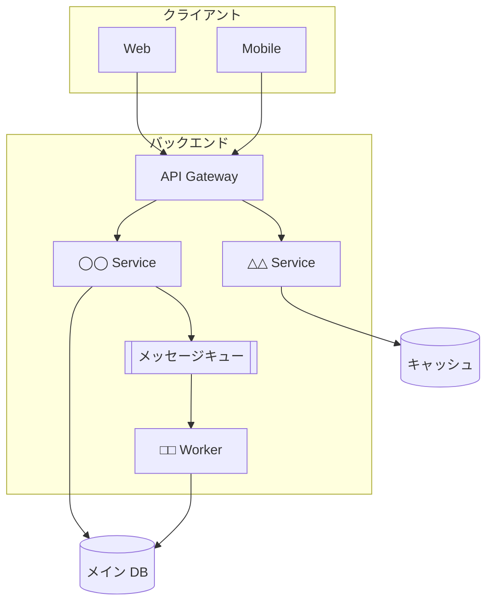
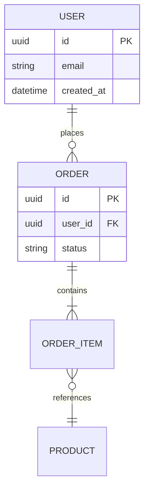

---
# 設計レビュー / アーキテクチャ決定（ADR）向け
# 特徴: 代替案の比較と「なぜその案にしたか」を残す
theme: default
# 共通のレイアウト / コンポーネント / スタイル（shared/）を読み込む
addons:
  - shared
title: ◯◯ 設計レビュー
info: |
  ## ◯◯ 設計レビュー
  設計レビュー会向けのスライドです。
author: Your Name
layout: cover
class: text-center
transition: slide-left
mdc: true
colorSchema: light
aspectRatio: 16/9
canvasWidth: 980
lineNumbers: false
drawings:
  persist: false
fonts:
  sans: Noto Sans JP
  serif: Noto Serif JP
  mono: Fira Code
  weights: '300,400,600,700'
  italic: false
exportFilename: design-review
---

# ◯◯ 設計レビュー

△△ 機能のアーキテクチャ設計

  2026-01-01 / Your Name

<!--
設計レビューは「承認をもらう場」ではなく「穴を見つけてもらう場」。
自信のない箇所を隠さず出すほど価値が出る。
-->

---

# レビューのお願い

## 重点的に見てほしい点

<v-clicks>

1. ◯◯ の分割単位は妥当か
2. △△ の障害時の挙動に漏れはないか
3. □□ のデータ整合性の担保方法

</v-clicks>

## 今回スコープ外

- UI の詳細設計
- 運用手順・監視設計
- 移行計画

  本日のゴール: 上記 3 点について合意し、未決事項の宿題化まで

<!--
レビュー観点を先に示すと、議論が発散しない。
スコープ外を明示するのも同じくらい重要。
-->

---

# 背景と要件

## 機能要件

- ◯◯ を △△ できること
- □□ の一覧を検索できること
- ◇◇ を外部システムに連携すること

## 非機能要件

| 項目 | 目標値 |
| --- | --- |
| 応答時間 | p95 < 300ms |
| 可用性 | 99.9% |
| 想定流量 | 500 req/s |
| データ量 | 年 100GB 増 |

<!--
非機能要件は必ず数値で置く。ここが曖昧だと設計の良し悪しが判定できない。
-->

---

# 全体アーキテクチャ

<!--
図は「これから説明する構造の地図」。
細部は次のスライド以降で分解する。
-->

---

# 主要コンポーネントの責務

| コンポーネント | 責務 | 責務外 |
| --- | --- | --- |
| API Gateway | 認証・ルーティング・レート制限 | ビジネスロジック |
| ◯◯ Service | △△ の登録・更新 | 通知の送信 |
| □□ Worker | 非同期の集計処理 | 同期的な応答 |

  「責務外」を書いておくと、後から機能が混入するのを防げます

---

# データモデル

<!--
状態遷移がある場合は stateDiagram も併用する。
「どの状態からどの状態に遷移しうるか」は設計レビューで漏れやすい。
-->

---

# 代替案の比較

| 観点 | A 案（採用） | B 案 | C 案 |
| --- | --- | --- | --- |
| 実装コスト | 中 | 小 | 大 |
| 性能 | ◎ p95 200ms | △ p95 800ms | ◎ p95 150ms |
| 運用負荷 | 低 | 低 | 高 |
| 拡張性 | ◎ | × | ◎ |
| チームの習熟度 | 中 | 高 | 低 |

  <strong>A 案を採用</strong>: 性能要件を満たしつつ、運用負荷を抑えられるため

<!--
「なぜ他案を捨てたか」が後から一番効いてくる。
半年後の自分と新メンバーのために必ず残す。
-->

---

# 採用案の詳細と根拠

<v-clicks>

- **決定**: ◯◯ を △△ 方式で実装する
- **理由 1**: 非機能要件（p95 < 300ms）を PoC で達成済み
- **理由 2**: 既存の □□ と同じ構成のため、運用手順を流用できる
- **理由 3**: 将来 ◇◇ を追加する際の変更範囲が小さい

</v-clicks>

  <strong>トレードオフ</strong>: B 案より初期実装が 2 週間長い。
  ただし運用開始後 3 ヶ月で回収できる見込み

<!--
トレードオフを明示すると、レビュワーが判断しやすくなる。
「デメリットなし」と主張する設計は疑われる。
-->

---

# 障害時の挙動

| 障害箇所 | 影響 | 挙動 | 復旧 |
| --- | --- | --- | --- |
| DB 停止 | 全機能停止 | 503 を返す | フェイルオーバー（〜60s） |
| キュー滞留 | 集計遅延 | 同期処理は継続 | 自動リトライ（最大 3 回） |
| 外部 API 停止 | 連携のみ停止 | キャッシュ値を返す | サーキットブレーカー |

<!--
正常系より異常系のほうがレビューで指摘が出る。
先に整理して持っていくとレビューが深いところまで進む。
-->

---
layout: center
class: text-center
---

# 未決事項

1. ◯◯ の保持期間（法務確認中 / 期限 1/20）
2. △△ のリトライ上限値（負荷試験後に決定）
3. □□ の権限モデル（△△ チームと調整中）

  本日の議論を踏まえ、ADR として文書化します

