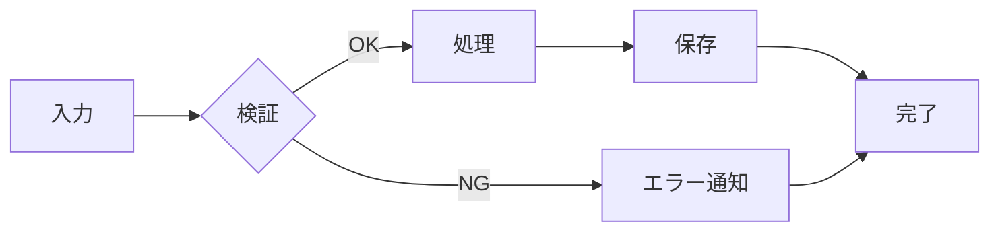
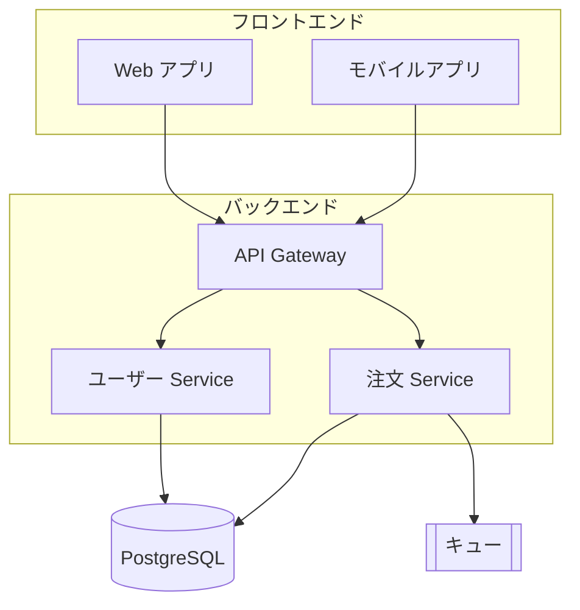
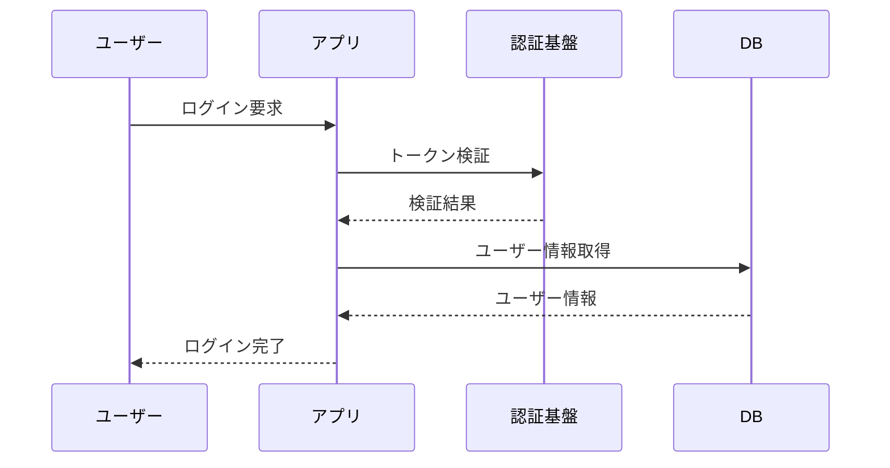
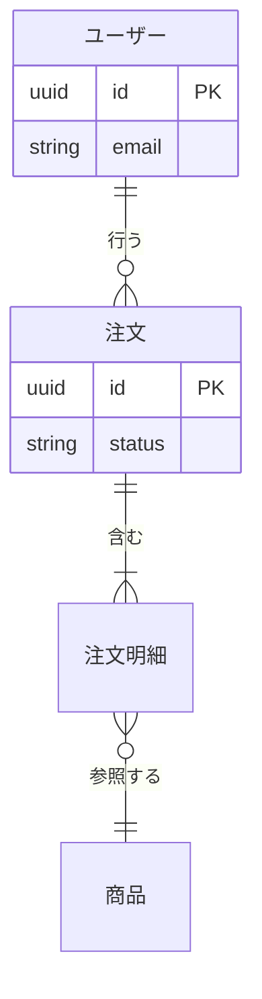
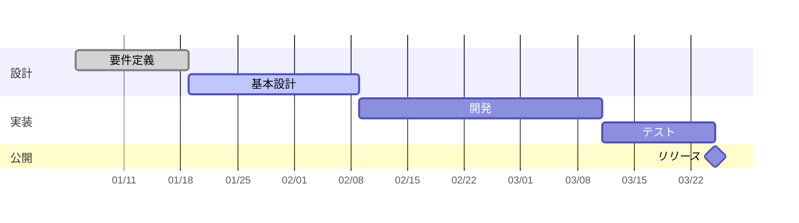
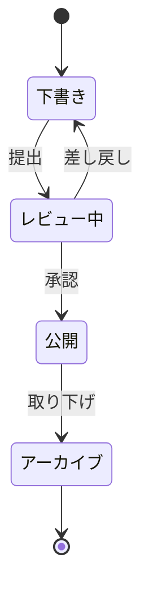
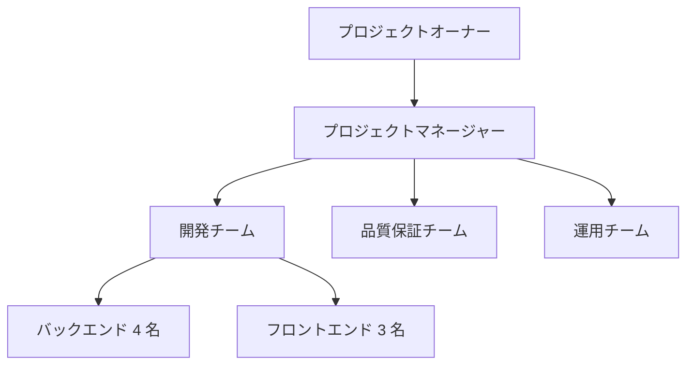

---
# 1 画面（1 スライド）単位のパターン集
# `pnpm run view patterns` で起動して閲覧し、使いたいスライドのソースを deck/slides.md にコピーしてください。
# 各スライド右上の「P01」のような小さなラベルは目印用なので、コピー後は削除して構いません。
#
# ===== マークアップの決まり =====
# 意味に合ったタグを使い、レイアウトのためだけの <div> は入れ子を最小限にしています。
#   列挙        <ul> / <ol> + <li>（テーマの list-style を消すため !list-none を付ける）
#   ラベルと値   <dl> / <dt> / <dd>
#   引用        <blockquote> + <figcaption><cite>
#   図表        <figure> + <figcaption>。CSS で描いた図には role="img" と aria-label
#   装飾のみ     aria-hidden="true"
#   日付        <time datetime="...">
#   表          Markdown の表、または <table>
# スライド内の小見出しは <h2> を使い、大きさはテーマ側の指定に勝つため !text-base のように ! を付けます。
theme: default
# 共通のレイアウト / コンポーネント / スタイル（shared/）を読み込む
addons:
  - shared
title: スライドパターン集
info: |
  ## スライドパターン集
  1 画面単位で使い回せるレイアウトのカタログです。
author: Your Name
layout: cover
class: text-center
transition: slide-left
mdc: true
colorSchema: light
aspectRatio: 16/9
canvasWidth: 980
lineNumbers: false
drawings:
  persist: false
fonts:
  sans: Noto Sans JP
  serif: Noto Serif JP
  mono: Fira Code
  weights: '300,400,600,700'
  italic: false
exportFilename: patterns
---

# スライドパターン集

1 画面単位でコピーして使えるレイアウト 67 種

<p class="mt-8 text-sm opacity-60">
  使いたいスライドを catalog/patterns.md からコピーして deck/slides.md に貼り付けてください
</p>

---
title: パターン一覧 A–D
---

# パターン一覧　A–D

<div class="grid grid-cols-4 gap-x-7 gap-y-6 mt-5 text-xs leading-relaxed">
  <nav aria-label="A 基本">
    <h2 class="!text-xs !mb-1 font-bold text-brand">A 基本</h2>
    <ul class="!list-none">
      <li>P01 表紙</li>
      <li>P02 表紙（背景画像）</li>
      <li>P03 目次</li>
      <li>P40 目次（現在地表示）</li>
      <li>P39 エグゼクティブサマリー</li>
      <li>P04 章扉</li>
      <li>P05 大きな一言</li>
      <li>P41 問いかけ</li>
    </ul>
  </nav>
  <nav aria-label="B テキスト">
    <h2 class="!text-xs !mb-1 font-bold text-brand">B テキスト</h2>
    <ul class="!list-none">
      <li>P06 箇条書き</li>
      <li>P42 2 カラムテキスト</li>
      <li>P07 番号付きステップ</li>
      <li>P43 アイコンカード×3</li>
      <li>P44 アイコングリッド×6</li>
      <li>P11 チェックリスト</li>
      <li>P12 Q &amp; A</li>
      <li>P10 引用</li>
      <li>P08 Before / After</li>
      <li>P09 Pros / Cons</li>
      <li>P45 2 案比較</li>
    </ul>
  </nav>
  <nav aria-label="C 数値・データ">
    <h2 class="!text-xs !mb-1 font-bold text-brand">C 数値・データ</h2>
    <ul class="!list-none">
      <li>P13 KPI カード</li>
      <li>P14 大きな数字</li>
      <li>P46 グラフ＋示唆</li>
      <li>P16 棒グラフ</li>
      <li>P47 グラフ 2 点並列</li>
      <li>P48 円グラフ＋内訳表</li>
      <li>P15 比較表</li>
      <li>P49 データテーブル</li>
      <li>P50 ウォーターフォール</li>
      <li>P17 進捗バー</li>
      <li>P18 2×2 マトリクス</li>
      <li>P51 ダッシュボード</li>
    </ul>
  </nav>
  <nav aria-label="D 図解">
    <h2 class="!text-xs !mb-1 font-bold text-brand">D 図解</h2>
    <ul class="!list-none">
      <li>P19 フロー図</li>
      <li>P20 アーキテクチャ図</li>
      <li>P21 シーケンス図</li>
      <li>P22 ER 図</li>
      <li>P23 ガントチャート</li>
      <li>P24 状態遷移図</li>
      <li>P25 横並びプロセス</li>
      <li>P52 縦積みステップ</li>
      <li>P53 サイクル図</li>
      <li>P54 スイムレーン</li>
      <li>P26 縦タイムライン</li>
      <li>P55 ピラミッド</li>
      <li>P56 ツリー・組織図</li>
      <li>P57 ベン図</li>
      <li>P58 レイヤー構成</li>
      <li>P59 ハブ＆スポーク</li>
    </ul>
  </nav>
</div>

---
title: パターン一覧 E–H
---

# パターン一覧　E–H

<div class="grid grid-cols-4 gap-x-7 gap-y-6 mt-5 text-xs leading-relaxed">
  <nav aria-label="E フレームワーク">
    <h2 class="!text-xs !mb-1 font-bold text-brand">E フレームワーク</h2>
    <ul class="!list-none">
      <li>P60 ポジショニングマップ</li>
      <li>P61 SWOT</li>
      <li>P62 ロードマップ</li>
      <li>P63 カスタマージャーニー</li>
      <li>P64 ファネル</li>
    </ul>
  </nav>
  <nav aria-label="F コード">
    <h2 class="!text-xs !mb-1 font-bold text-brand">F コード</h2>
    <ul class="!list-none">
      <li>P27 コード全画面</li>
      <li>P28 コード＋解説</li>
      <li>P29 差分（diff）</li>
      <li>P30 ターミナル</li>
      <li>P31 数式</li>
    </ul>
  </nav>
  <nav aria-label="G 画像">
    <h2 class="!text-xs !mb-1 font-bold text-brand">G 画像</h2>
    <ul class="!list-none">
      <li>P32 画像右</li>
      <li>P33 全画面画像</li>
      <li>P34 画像グリッド</li>
      <li>P65 製品スクリーンショット</li>
    </ul>
  </nav>
  <nav aria-label="H 人・締め">
    <h2 class="!text-xs !mb-1 font-bold text-brand">H 人・締め</h2>
    <ul class="!list-none">
      <li>P35 プロフィール</li>
      <li>P66 ペルソナ</li>
      <li>P36 チーム紹介</li>
      <li>P67 ケーススタディ</li>
      <li>P37 まとめ</li>
      <li>P38 クロージング</li>
    </ul>
  </nav>
</div>

<p class="mt-8 note-box text-xs">
  番号は識別子です。並び順ではなくカテゴリで探してください。P39 以降は後から追補した型です。
</p>

---
layout: section-divider
number: "A"
---

# 基本

表紙・目次・章扉

---
title: P01 表紙
layout: cover
class: text-center
---

<p class="abs-tr m-4 text-xs opacity-40">P01 表紙</p>

<div class="mx-auto max-w-2xl border-t border-b border-gray-300 dark:border-gray-700 py-10">
  <h1 class="!mb-3">プレゼンテーションのタイトル</h1>
  <p class="text-lg opacity-60">サブタイトルを一行で</p>
</div>

<p class="mt-12 text-sm opacity-50">
  <time datetime="2026-01-01">2026年1月1日</time>　／　株式会社◯◯　Your Name
</p>

<!--
用途: 表紙、提案書の顔。
レイアウト規則: 画面中央にタイトルとサブタイトル。上下を細罫で挟み、最下部に日付・組織名。
余白を大きく取り、装飾は入れない。
-->

---
title: P02 表紙（背景画像）
layout: cover
background: /images/placeholder.svg
class: text-white
---

<p class="abs-tr m-4 text-xs opacity-60">P02 表紙（背景画像）</p>

<div class="absolute inset-0 bg-black/45" aria-hidden="true"></div>

<div class="absolute left-14 bottom-24 text-left">
  <h1 class="!mb-3 drop-shadow">背景画像つきの表紙</h1>
  <p class="text-lg opacity-90 drop-shadow">frontmatter に background を書くだけ</p>
</div>

<p class="absolute left-14 bottom-12 text-sm opacity-80">
  <time datetime="2026-01-01">2026年1月1日</time>　／　Your Name
</p>

<!--
用途: ブランド資料、社外提案の表紙。
レイアウト規則: 全面写真＋暗めのオーバーレイ。タイトルは左下寄せで白抜き。文字要素は 3 つまで。
画像は public/ に置き、background: /images/xxx.jpg で指定する。
-->

---
title: P03 目次
---

<p class="abs-tr m-4 text-xs opacity-40">P03 目次</p>

# 本日のご説明

<nav aria-label="目次">
  <ol class="!list-none mt-6">
    <li class="flex items-baseline gap-5 py-3 border-b border-gray-200 dark:border-gray-700">
      <span class="text-brand font-bold text-sm w-8 shrink-0" aria-hidden="true">01</span>
      <span>背景と課題</span>
    </li>
    <li class="flex items-baseline gap-5 py-3 border-b border-gray-200 dark:border-gray-700">
      <span class="text-brand font-bold text-sm w-8 shrink-0" aria-hidden="true">02</span>
      <span>提案する解決策</span>
    </li>
    <li class="flex items-baseline gap-5 py-3 border-b border-gray-200 dark:border-gray-700">
      <span class="text-brand font-bold text-sm w-8 shrink-0" aria-hidden="true">03</span>
      <span>導入の進め方</span>
    </li>
    <li class="flex items-baseline gap-5 py-3 border-b border-gray-200 dark:border-gray-700">
      <span class="text-brand font-bold text-sm w-8 shrink-0" aria-hidden="true">04</span>
      <span>効果と次の一歩</span>
    </li>
  </ol>
</nav>

<!--
用途: 目次、本日のご説明。
レイアウト規則: 通し番号つきの項目を縦に 4〜6 行。各行の下に細罫。番号は控えめな色で。
項目が 7 件以上になるなら 2 カラムに振り分ける。

補足: Slidev には見出しから自動生成する <Toc /> があるが、スライド数が多いデッキでは
画面からあふれるため、章立てを手で書くほうが確実。
-->

---
title: P40 目次（現在地表示）
---

<p class="abs-tr m-4 text-xs opacity-40">P40 目次（現在地表示）</p>

<div class="grid grid-cols-[220px_1fr] gap-12 h-[400px] items-stretch">
  <nav class="note-box h-full pt-6" aria-label="目次">
    <p class="text-xs opacity-50 tracking-widest mb-5">CONTENTS</p>
    <ol class="!list-none space-y-4 text-sm">
      <li class="opacity-35">01　背景と課題</li>
      <li class="flex items-center gap-2 font-bold text-brand" aria-current="step">
        <span class="w-1 h-4 bg-brand" aria-hidden="true"></span>02　提案する解決策
      </li>
      <li class="opacity-35">03　導入の進め方</li>
      <li class="opacity-35">04　効果と次の一歩</li>
    </ol>
  </nav>
  <div class="flex flex-col justify-center">
    <p class="text-8xl font-bold text-brand opacity-25 leading-none" aria-hidden="true">02</p>
    <h2 class="!text-4xl !mb-0 mt-5">提案する解決策</h2>
    <p class="mt-4 opacity-60">◯◯ を △△ で自動化し、属人化を解消します</p>
  </div>
</div>

<!--
用途: 長い資料の章扉。今どこを話しているかを常に示したいとき。
レイアウト規則: 左に目次サイドバー、現在の章だけを濃く。右に大きく章番号と章タイトル。
現在地の項目には aria-current="step" を付ける。
-->

---
title: P39 エグゼクティブサマリー
---

<p class="abs-tr m-4 text-xs opacity-40">P39 エグゼクティブサマリー</p>

# 結論

<p class="callout-box text-lg">
  <strong>◯◯ を導入し、△△ の工数を年間 480 時間削減することを提案します</strong>
</p>

<ol class="!list-none mt-8 space-y-6">
  <li class="flex items-start gap-4">
    <span class="num-badge w-7 h-7 text-sm" aria-hidden="true">1</span>
    <span>
      <strong class="block">現状は月 40 時間を手作業に費やしている</strong>
      <small class="opacity-60">2025 年 10〜12 月の稼働ログより</small>
    </span>
  </li>
  <li class="flex items-start gap-4">
    <span class="num-badge w-7 h-7 text-sm" aria-hidden="true">2</span>
    <span>
      <strong class="block">自動化により作業時間を 85% 削減できる</strong>
      <small class="opacity-60">1 チームでの試行結果（2025 年 12 月）</small>
    </span>
  </li>
  <li class="flex items-start gap-4">
    <span class="num-badge w-7 h-7 text-sm" aria-hidden="true">3</span>
    <span>
      <strong class="block">投資は 6 ヶ月で回収できる見込み</strong>
      <small class="opacity-60">初期費用 240 万円 / 年間削減額 480 万円</small>
    </span>
  </li>
</ol>

<!--
用途: 経営層向け。冒頭で結論を先に出す。
レイアウト規則: 冒頭に結論の帯を 1 本、その下に根拠を 3 点。各点は見出し 1 行＋補足 1 行。
-->

---
title: P04 章扉
layout: section-divider
number: "01"
---

<p class="abs-tr m-4 text-xs opacity-60">P04 章扉</p>

# 章のタイトル

この章で扱うことを 1 行で

<!--
用途: 章の区切り、話題転換。
レイアウト規則: 左に大きな章番号、右に章タイトルと一行の要約。
layout: section-divider と number: "01" を frontmatter に書くだけで使える。
-->

---
title: P05 大きな一言
layout: center
class: text-center
---

<p class="abs-tr m-4 text-xs opacity-40">P05 大きな一言</p>

<p class="text-5xl font-bold leading-tight">
  一番伝えたいことは<br>
  <span class="text-brand">1 枚に 1 つ</span>だけ
</p>

<p class="mt-10 text-lg opacity-60">補足はここに小さく</p>

<!--
用途: 主張の宣言、章のまとめ。
レイアウト規則: 伝えたい一文だけを 2 行以内で大きく。他の要素は置かない。
-->

---
title: P41 問いかけ
---

<p class="abs-tr m-4 text-xs opacity-40">P41 問いかけ</p>

<div class="flex items-center gap-12 h-[400px]">
  <p class="text-[9rem] font-bold text-brand opacity-25 leading-none" aria-hidden="true">?</p>
  <div>
    <p class="text-4xl font-bold leading-snug">その作業、<br>本当に人がやる必要はありますか</p>
    <p class="mt-8 text-lg opacity-60 leading-relaxed">
      月 40 時間のうち、判断を伴う工程は 3 時間だけでした。<br>
      残りの 37 時間は何をしていたのでしょうか。
    </p>
  </div>
</div>

<!--
用途: 議論の起点、課題提起。
レイアウト規則: 左に大きな問い、右に補足を 2 行。このページでは答えを書かず、次のページに送る。
-->

---
layout: section-divider
number: "B"
---

# テキスト

箇条書き・比較・引用

---
title: P06 箇条書き
---

<p class="abs-tr m-4 text-xs opacity-40">P06 箇条書き</p>

# 箇条書き（段階表示）

<v-clicks>

- 1 つ目のポイント
- 2 つ目のポイント
- 3 つ目のポイント

</v-clicks>

<p v-click class="mt-8 callout-box">最後に結論を出すと締まります</p>

<!--
用途: 最も汎用。説明・報告全般。
レイアウト規則: 1 項目 1 行、体言止めで揃える。4 点まで。
Markdown のリストはそのまま <ul> になるので、素直に書けばよい。
-->

---
title: P42 2カラムテキスト
layout: two-cols
layoutClass: gap-12
---

<p class="abs-tr m-4 text-xs opacity-40">P42 2カラムテキスト</p>

# 現状

<div class="hair mt-4 pt-5 text-sm leading-loose opacity-85">

◯◯ の運用は △△ 部が手作業で行っています。月次で 40 時間を要し、
担当者は 1 名に固定されています。

手順書は存在しますが更新が追いついておらず、
実際の作業とは差分が生じています。

</div>

::right::

# 課題

<div class="hair mt-4 pt-5 text-sm leading-loose opacity-85">

作業時間そのものより **属人化** が問題です。
担当者が不在の週は処理が滞り、月末に集中します。

差し戻しも月 12 件発生しており、
原因の切り分けに毎回 2 時間ほどかかっています。

</div>

<!--
用途: 現状と課題、原因と対策など、対になる説明。
レイアウト規則: 見出し付きの文章ブロックを左右に。文量は左右でほぼ揃える。
-->

---
title: P07 番号付きステップ
---

<p class="abs-tr m-4 text-xs opacity-40">P07 番号付きステップ</p>

# 番号付きステップ

<ol class="!list-none mt-8 space-y-5">
  <li v-click class="flex items-start gap-4">
    <span class="num-badge w-9 h-9" aria-hidden="true">1</span>
    <span>
      <strong class="block">最初にやること</strong>
      <small class="opacity-70">補足説明をここに書きます</small>
    </span>
  </li>
  <li v-click class="flex items-start gap-4">
    <span class="num-badge w-9 h-9" aria-hidden="true">2</span>
    <span>
      <strong class="block">次にやること</strong>
      <small class="opacity-70">補足説明をここに書きます</small>
    </span>
  </li>
  <li v-click class="flex items-start gap-4">
    <span class="num-badge w-9 h-9" aria-hidden="true">3</span>
    <span>
      <strong class="block">最後にやること</strong>
      <small class="opacity-70">補足説明をここに書きます</small>
    </span>
  </li>
</ol>

<!--
用途: 手順の提示。順序に意味があるものは必ず <ol> で書く。
レイアウト規則: 番号は円形バッジ、右に見出しと補足 1 行。
-->

---
title: P43 アイコンカード×3
---

<p class="abs-tr m-4 text-xs opacity-40">P43 アイコンカード×3</p>

# 3 つの特徴

<ul class="!list-none grid grid-cols-3 gap-6 mt-10">
  <li class="card-box">
    <p class="w-12 h-12 rounded-full bg-brand/15 center-box text-2xl" aria-hidden="true">⚡</p>
    <h2 class="!text-base !mb-0 mt-4">すぐ使える</h2>
    <p class="mt-2 text-sm opacity-70 leading-relaxed">初期設定は 15 分。既存システムの改修は不要です。</p>
  </li>
  <li class="card-box">
    <p class="w-12 h-12 rounded-full bg-brand/15 center-box text-2xl" aria-hidden="true">🛡</p>
    <h2 class="!text-base !mb-0 mt-4">ミスを防ぐ</h2>
    <p class="mt-2 text-sm opacity-70 leading-relaxed">入力時に自動検証し、異常は即座に通知します。</p>
  </li>
  <li class="card-box">
    <p class="w-12 h-12 rounded-full bg-brand/15 center-box text-2xl" aria-hidden="true">👥</p>
    <h2 class="!text-base !mb-0 mt-4">誰でも運用できる</h2>
    <p class="mt-2 text-sm opacity-70 leading-relaxed">専門知識は不要。担当者の交代にも耐えます。</p>
  </li>
</ul>

<!--
用途: サービスの特徴、3 つの価値。
レイアウト規則: アイコン・見出し・説明 2 行のカードを 3 枚横並び。高さを必ず揃える。
アイコンは意味を持たないので aria-hidden にし、見出しの文言で内容を伝える。
-->

---
title: P44 アイコングリッド×6
---

<p class="abs-tr m-4 text-xs opacity-40">P44 アイコングリッド×6</p>

# 対応している領域

<ul class="!list-none grid grid-cols-3 gap-y-10 gap-x-6 mt-10 text-center">
  <li><span class="w-14 h-14 rounded-full bg-brand/15 center-box text-2xl mx-auto" aria-hidden="true">📊</span><span class="block mt-3 text-sm">データ集計</span></li>
  <li><span class="w-14 h-14 rounded-full bg-brand/15 center-box text-2xl mx-auto" aria-hidden="true">🔄</span><span class="block mt-3 text-sm">定期実行</span></li>
  <li><span class="w-14 h-14 rounded-full bg-brand/15 center-box text-2xl mx-auto" aria-hidden="true">🔔</span><span class="block mt-3 text-sm">異常通知</span></li>
  <li><span class="w-14 h-14 rounded-full bg-brand/15 center-box text-2xl mx-auto" aria-hidden="true">🔐</span><span class="block mt-3 text-sm">権限管理</span></li>
  <li><span class="w-14 h-14 rounded-full bg-brand/15 center-box text-2xl mx-auto" aria-hidden="true">🔌</span><span class="block mt-3 text-sm">外部連携</span></li>
  <li><span class="w-14 h-14 rounded-full bg-brand/15 center-box text-2xl mx-auto" aria-hidden="true">📁</span><span class="block mt-3 text-sm">履歴保存</span></li>
</ul>

<!--
用途: 機能一覧、対応領域の俯瞰。
レイアウト規則: アイコン＋短い語句を 3 列 2 段。説明文は入れず単語で並べる。
-->

---
title: P11 チェックリスト
---

<p class="abs-tr m-4 text-xs opacity-40">P11 チェックリスト</p>

# 導入前チェックリスト

<ul class="!list-none mt-8 space-y-3 text-lg">
  <li v-click class="flex items-center gap-3"><span class="text-green-600" aria-hidden="true">✅</span><span>Node.js 20 以上がインストールされている<span class="sr-only">（完了）</span></span></li>
  <li v-click class="flex items-center gap-3"><span class="text-green-600" aria-hidden="true">✅</span><span>リポジトリへの書き込み権限がある<span class="sr-only">（完了）</span></span></li>
  <li v-click class="flex items-center gap-3"><span class="text-amber-500" aria-hidden="true">🔲</span><span>本番環境の設定値が確認できている<span class="sr-only">（未完了）</span></span></li>
  <li v-click class="flex items-center gap-3"><span class="text-amber-500" aria-hidden="true">🔲</span><span>ロールバック手順が用意されている<span class="sr-only">（未完了）</span></span></li>
</ul>

<!--
用途: 要件確認、導入準備。
レイアウト規則: チェック済みと未着手を色で分ける。4〜6 行まで。
記号だけでは状態が伝わらないので、sr-only のテキストで補う。
-->

---
title: P12 Q&A
---

<p class="abs-tr m-4 text-xs opacity-40">P12 Q &amp; A</p>

# よくある質問

<dl class="mt-6 space-y-5">
  <div v-click>
    <dt class="font-bold text-brand">Q. 既存システムの改修は必要ですか？</dt>
    <dd class="mt-1 text-sm opacity-80">A. 不要です。API 経由で連携するため、既存コードには手を入れません。</dd>
  </div>
  <div v-click>
    <dt class="font-bold text-brand">Q. 導入にどれくらいかかりますか？</dt>
    <dd class="mt-1 text-sm opacity-80">A. 標準的な構成で 2 週間程度です。</dd>
  </div>
  <div v-click>
    <dt class="font-bold text-brand">Q. 途中でやめられますか？</dt>
    <dd class="mt-1 text-sm opacity-80">A. データはすべてエクスポートできます。ロックインはありません。</dd>
  </div>
</dl>

<!--
用途: 想定質疑への先回り、Appendix。
レイアウト規則: 問いと答えの対なので <dl> で組む。dt と dd を <div> で包むのは HTML 仕様上も正しい。
-->

---
title: P10 引用
layout: center
---

<p class="abs-tr m-4 text-xs opacity-40">P10 引用</p>

<figure class="max-w-3xl">
  <p class="text-6xl text-brand opacity-30 leading-none" aria-hidden="true">&ldquo;</p>
  <blockquote class="!bg-transparent !text-inherit !border-0 !p-0 !text-2xl leading-relaxed -mt-6 pl-4">
    シンプルさは究極の洗練である。
  </blockquote>
  <figcaption class="mt-6 pl-4 text-sm opacity-60">
    — <cite class="not-italic">レオナルド・ダ・ヴィンチ</cite>
  </figcaption>
</figure>

<!--
用途: 顧客の声、有識者の発言。
レイアウト規則: 大きな引用符、引用文 2〜3 行、下に出典と肩書き。
テーマは blockquote をコード風に装飾するため、! 付きユーティリティで打ち消している。
-->

---
title: P08 Before / After
layout: two-cols
layoutClass: gap-8
---

<p class="abs-tr m-4 text-xs opacity-40">P08 Before / After</p>

# Before

<ul class="!list-none note-box mt-4 space-y-2">
  <li>手作業で対応していた</li>
  <li>月 40 時間かかっていた</li>
  <li>担当者は 1 名のみ</li>
</ul>

::right::

# After

<ul class="!list-none callout-box mt-4 space-y-2">
  <li>自動で処理される</li>
  <li>月 6 時間に短縮</li>
  <li>5 名が対応可能</li>
</ul>

<!--
用途: 改善提案、導入効果。
レイアウト規則: 左に現状、右に改善後。同じ項目順・同じ粒度で並べ、差分だけを強調色に。
-->

---
title: P09 Pros / Cons
---

<p class="abs-tr m-4 text-xs opacity-40">P09 Pros / Cons</p>

# メリットとデメリット

<div class="grid grid-cols-2 gap-6 mt-8">
  <section class="p-5 rounded-lg bg-green-50 dark:bg-green-900/20">
    <h2 class="!text-base !mb-0 font-bold text-green-700 dark:text-green-400">✓ メリット</h2>
    <ul class="!list-none mt-3 text-sm space-y-2">
      <li>導入コストが低い</li>
      <li>既存の仕組みを変えずに済む</li>
      <li>すぐに効果が出る</li>
    </ul>
  </section>
  <section class="p-5 rounded-lg bg-red-50 dark:bg-red-900/20">
    <h2 class="!text-base !mb-0 font-bold text-red-700 dark:text-red-400">✗ デメリット</h2>
    <ul class="!list-none mt-3 text-sm space-y-2">
      <li>大規模化すると限界がある</li>
      <li>専用の運用手順が必要</li>
      <li>◯◯ には対応していない</li>
    </ul>
  </section>
</div>

<!--
用途: 評価、リスク説明。
レイアウト規則: 左に利点、右に懸念。色は使い分けるが原色は避ける。各 3 項目まで。
-->

---
title: P45 2案比較
---

<p class="abs-tr m-4 text-xs opacity-40">P45 2案比較</p>

# 2 つの選択肢

<div class="grid grid-cols-2 mt-8">
  <section class="pr-10 border-r border-gray-300 dark:border-gray-700">
    <h2 class="!text-base !mb-0 callout-box"><strong>A 案</strong>　内製で作る</h2>
    <dl class="mt-6 space-y-4 text-sm">
      <div><dt class="inline opacity-50 mr-3">初期費用</dt><dd class="inline">0 円</dd></div>
      <div><dt class="inline opacity-50 mr-3">期間</dt><dd class="inline">3 ヶ月</dd></div>
      <div><dt class="inline opacity-50 mr-3">運用</dt><dd class="inline">自チームで対応</dd></div>
      <div><dt class="inline opacity-50 mr-3">拡張性</dt><dd class="inline">要件に完全に合わせられる</dd></div>
    </dl>
  </section>
  <section class="pl-10">
    <h2 class="!text-base !mb-0 note-box"><strong>B 案</strong>　SaaS を導入する</h2>
    <dl class="mt-6 space-y-4 text-sm">
      <div><dt class="inline opacity-50 mr-3">初期費用</dt><dd class="inline">240 万円</dd></div>
      <div><dt class="inline opacity-50 mr-3">期間</dt><dd class="inline">2 週間</dd></div>
      <div><dt class="inline opacity-50 mr-3">運用</dt><dd class="inline">ベンダーに委託</dd></div>
      <div><dt class="inline opacity-50 mr-3">拡張性</dt><dd class="inline">提供機能の範囲内</dd></div>
    </dl>
  </section>
</div>

<!--
用途: 選択肢の提示、意思決定を仰ぐ場面。
レイアウト規則: 左右に案 A・案 B を対置。見出し帯の下に同じ項目順で内容を並べ、中央に境界線。
推す案の帯だけを callout-box にすると視線が誘導できる。
-->

---
layout: section-divider
number: "C"
---

# 数値・データ

指標を見せる

---
title: P13 KPI カード
---

<p class="abs-tr m-4 text-xs opacity-40">P13 KPI カード</p>

# 主要な指標

<dl class="grid grid-cols-3 gap-6 mt-10 text-center">
  <div class="note-box">
    <dt class="text-sm opacity-60">作業時間</dt>
    <dd class="text-4xl font-bold mt-2 text-brand">-85%</dd>
    <dd class="text-xs mt-2 opacity-60">40h → 6h / 月</dd>
  </div>
  <div class="note-box">
    <dt class="text-sm opacity-60">エラー件数</dt>
    <dd class="text-4xl font-bold mt-2 text-brand">0<span class="text-lg">件</span></dd>
    <dd class="text-xs mt-2 opacity-60">導入後 12 ヶ月</dd>
  </div>
  <div class="note-box">
    <dt class="text-sm opacity-60">利用者数</dt>
    <dd class="text-4xl font-bold mt-2 text-brand">240<span class="text-lg">社</span></dd>
    <dd class="text-xs mt-2 opacity-60">前年比 +68%</dd>
  </div>
</dl>

<!--
用途: 実績サマリー、月次報告。
レイアウト規則: 横並びのカード 3 枚。指標名・数値・補足の 3 段。数値の桁は揃える。
指標名と値の対応なので <dl> で組む。
-->

---
title: P14 大きな数字
layout: center
class: text-center
---

<p class="abs-tr m-4 text-xs opacity-40">P14 大きな数字</p>

<dl>
  <dt class="text-sm opacity-60 tracking-widest">導入企業数</dt>
  <dd class="text-8xl font-bold text-brand mt-4 leading-none">240<span class="text-4xl">社</span></dd>
</dl>

<p class="mt-8 text-lg opacity-70">継続率 97%、平均導入期間 2 週間</p>

<!--
用途: インパクト提示、市場規模。
レイアウト規則: 数字ひとつを画面いっぱいに。直下にラベル、その下に出典を小さく。
-->

---
title: P46 グラフ＋示唆
---

<p class="abs-tr m-4 text-xs opacity-40">P46 グラフ＋示唆</p>

# 処理件数の推移

<p class="callout-box">
  <strong>直近 4 ヶ月で処理件数は 3.3 倍になり、手作業では追いつかない水準に達した</strong>
</p>

<div class="grid grid-cols-[1fr_260px] gap-8 mt-6">
  <figure role="img" aria-label="月別処理件数。10月 120 件、11月 180 件、12月 260 件、1月 400 件">
    <div class="flex items-end gap-5 h-[190px] px-2">
      <div class="flex-1 flex flex-col items-center justify-end h-full">
        <span class="text-xs mb-1 opacity-60">120</span>
        <span class="w-full bg-gray-300 dark:bg-gray-600 rounded-t" style="height: 30%"></span>
        <span class="text-xs mt-2 opacity-70">10月</span>
      </div>
      <div class="flex-1 flex flex-col items-center justify-end h-full">
        <span class="text-xs mb-1 opacity-60">180</span>
        <span class="w-full bg-gray-300 dark:bg-gray-600 rounded-t" style="height: 45%"></span>
        <span class="text-xs mt-2 opacity-70">11月</span>
      </div>
      <div class="flex-1 flex flex-col items-center justify-end h-full">
        <span class="text-xs mb-1 opacity-60">260</span>
        <span class="w-full bg-gray-300 dark:bg-gray-600 rounded-t" style="height: 65%"></span>
        <span class="text-xs mt-2 opacity-70">12月</span>
      </div>
      <div class="flex-1 flex flex-col items-center justify-end h-full">
        <span class="text-xs mb-1 font-bold">400</span>
        <span class="w-full bg-brand rounded-t" style="height: 100%"></span>
        <span class="text-xs mt-2 font-bold">1月</span>
      </div>
    </div>
    <figcaption class="mt-3 text-xs opacity-50">単位: 件 / 出典: 業務システム稼働ログ（2025-10 〜 2026-01）</figcaption>
  </figure>
  <ul class="!list-none text-sm space-y-4 pt-2">
    <li class="flex gap-2"><span class="text-brand font-bold" aria-hidden="true">・</span>12 月以降の伸びが急である</li>
    <li class="flex gap-2"><span class="text-brand font-bold" aria-hidden="true">・</span>増加分の 8 割は ◯◯ 経由</li>
    <li class="flex gap-2"><span class="text-brand font-bold" aria-hidden="true">・</span>処理能力の上限は月 300 件</li>
  </ul>
</div>

<!--
用途: データを根拠に主張するとき。最も出番が多い型。
レイアウト規則: 上に結論の帯、左 2/3 にグラフ、右 1/3 に読み取れることを 3 点。
CSS で描いたグラフは読み上げできないので、figure に role="img" と aria-label で数値を書く。
単位と出典は figcaption に置く。
-->

---
title: P16 棒グラフ
---

<p class="abs-tr m-4 text-xs opacity-40">P16 棒グラフ</p>

# 月別の処理件数

<figure role="img" aria-label="月別処理件数。10月 120 件、11月 180 件、12月 260 件、1月 400 件">
  <div class="flex items-end gap-5 h-[260px] mt-8 px-4">
    <div class="flex-1 flex flex-col items-center justify-end h-full">
      <span class="text-xs mb-1 opacity-60">120</span>
      <span class="w-full bg-gray-300 dark:bg-gray-600 rounded-t" style="height: 30%"></span>
      <span class="text-xs mt-2 opacity-70">10月</span>
    </div>
    <div class="flex-1 flex flex-col items-center justify-end h-full">
      <span class="text-xs mb-1 opacity-60">180</span>
      <span class="w-full bg-gray-300 dark:bg-gray-600 rounded-t" style="height: 45%"></span>
      <span class="text-xs mt-2 opacity-70">11月</span>
    </div>
    <div class="flex-1 flex flex-col items-center justify-end h-full">
      <span class="text-xs mb-1 opacity-60">260</span>
      <span class="w-full bg-gray-300 dark:bg-gray-600 rounded-t" style="height: 65%"></span>
      <span class="text-xs mt-2 opacity-70">12月</span>
    </div>
    <div class="flex-1 flex flex-col items-center justify-end h-full">
      <span class="text-xs mb-1 font-bold">400</span>
      <span class="w-full bg-brand rounded-t" style="height: 100%"></span>
      <span class="text-xs mt-2 font-bold">1月</span>
    </div>
  </div>
  <figcaption class="mt-4 text-xs opacity-60 text-center">
    ※ 本格的なグラフが必要な場合は画像を貼るか、Vue コンポーネントを作成します
  </figcaption>
</figure>

<!--
用途: 単純な量の比較。
レイアウト規則: 強調したい 1 本だけを brand 色に。値は棒の上、ラベルは棒の下。
-->

---
title: P47 グラフ2点並列
---

<p class="abs-tr m-4 text-xs opacity-40">P47 グラフ2点並列</p>

# 前年との比較

<div class="grid grid-cols-2 gap-10 mt-8">
  <figure role="img" aria-label="2025 年の四半期別件数。Q1 140、Q2 175、Q3 210、Q4 240">
    <figcaption class="text-sm font-bold mb-3">2025 年</figcaption>
    <div class="flex items-end gap-3 h-[200px]">
      <div class="flex-1 flex flex-col items-center justify-end h-full"><span class="w-full bg-gray-300 dark:bg-gray-600 rounded-t" style="height: 28%"></span><span class="text-xs mt-2 opacity-60">Q1</span></div>
      <div class="flex-1 flex flex-col items-center justify-end h-full"><span class="w-full bg-gray-300 dark:bg-gray-600 rounded-t" style="height: 35%"></span><span class="text-xs mt-2 opacity-60">Q2</span></div>
      <div class="flex-1 flex flex-col items-center justify-end h-full"><span class="w-full bg-gray-300 dark:bg-gray-600 rounded-t" style="height: 42%"></span><span class="text-xs mt-2 opacity-60">Q3</span></div>
      <div class="flex-1 flex flex-col items-center justify-end h-full"><span class="w-full bg-gray-300 dark:bg-gray-600 rounded-t" style="height: 48%"></span><span class="text-xs mt-2 opacity-60">Q4</span></div>
    </div>
  </figure>
  <figure role="img" aria-label="2026 年の四半期別件数。Q1 260、Q2 340、Q3 420、Q4 500">
    <figcaption class="text-sm font-bold mb-3">2026 年</figcaption>
    <div class="flex items-end gap-3 h-[200px]">
      <div class="flex-1 flex flex-col items-center justify-end h-full"><span class="w-full bg-brand rounded-t" style="height: 52%"></span><span class="text-xs mt-2 opacity-60">Q1</span></div>
      <div class="flex-1 flex flex-col items-center justify-end h-full"><span class="w-full bg-brand rounded-t" style="height: 68%"></span><span class="text-xs mt-2 opacity-60">Q2</span></div>
      <div class="flex-1 flex flex-col items-center justify-end h-full"><span class="w-full bg-brand rounded-t" style="height: 84%"></span><span class="text-xs mt-2 opacity-60">Q3</span></div>
      <div class="flex-1 flex flex-col items-center justify-end h-full"><span class="w-full bg-brand rounded-t" style="height: 100%"></span><span class="text-xs mt-2 opacity-60">Q4</span></div>
    </div>
  </figure>
</div>

<p class="mt-4 text-xs opacity-50">※ 左右とも縦軸は同じスケール（0〜500 件）</p>

<!--
用途: 前年比較、2 指標の同時提示。
レイアウト規則: 同じ縦軸スケールで 2 つのグラフを並べる。スケールが違う場合は必ず明記する。
-->

---
title: P48 円グラフ＋内訳表
---

<p class="abs-tr m-4 text-xs opacity-40">P48 円グラフ＋内訳表</p>

# 問い合わせの内訳

<div class="grid grid-cols-[240px_1fr] gap-12 mt-8 items-center">
  <figure class="center-box" role="img" aria-label="問い合わせの構成比。操作方法の確認 42%、不具合の報告 26%、要望・改善提案 32%">
    <div class="w-48 h-48 rounded-full" style="background: conic-gradient(#3aa675 0 42%, #7cc4a4 42% 68%, #cfe7dc 68% 100%)"></div>
  </figure>
  <div>

| 分類 | 件数 | 構成比 |
| --- | ---: | ---: |
| 操作方法の確認 | 504 | 42% |
| 不具合の報告 | 312 | 26% |
| 要望・改善提案 | 384 | 32% |
| **合計** | **1,200** | **100%** |

  </div>
</div>

<!--
用途: 構成比とその内訳を同時に見せる。
レイアウト規則: 左に全体像のグラフ、右に内訳の表。表は行数 7 以下、数値は右揃え。
円グラフは conic-gradient 一発で描ける。数値は表側にあるので図は role="img" で概要だけ伝える。
-->

---
title: P15 比較表
---

<p class="abs-tr m-4 text-xs opacity-40">P15 比較表</p>

# 比較表

| 観点 | A 案（推奨） | B 案 | C 案 |
| --- | --- | --- | --- |
| 初期費用 | **0 円** | 50 万円 | 200 万円 |
| 導入期間 | **2 週間** | 1 ヶ月 | 3 ヶ月 |
| 運用負荷 | 低 | 低 | 高 |
| 拡張性 | ◎ | △ | ◎ |
| 総合評価 | **◎** | ○ | △ |

<p class="mt-6 text-xs opacity-60">※ 推奨する行や列は太字にして視線を誘導します</p>

<!--
用途: ベンダー比較、プラン比較。
レイアウト規則: 1 列目に評価軸、2 列目以降に選択肢。推し案の列を太字にする。
Markdown の表がそのまま <table> になるので、無理に HTML で組まない。
-->

---
title: P49 データテーブル
---

<p class="abs-tr m-4 text-xs opacity-40">P49 データテーブル</p>

# 拠点別の実績

| 拠点 | 対象件数 | 完了 | 完了率 | 平均日数 |
| --- | ---: | ---: | ---: | ---: |
| 東京 | 1,240 | 1,198 | 96.6% | 2.4 |
| 大阪 | 860 | 812 | 94.4% | 2.8 |
| 名古屋 | 540 | 502 | 93.0% | 3.1 |
| 福岡 | 320 | 214 | **66.9%** | **6.2** |
| 札幌 | 180 | 172 | 95.6% | 2.6 |
| **合計** | **3,140** | **2,898** | **92.3%** | **3.0** |

<p class="mt-5 text-xs opacity-50">出典: 業務システム（2026-01 締め）／ 太字は要確認箇所</p>

<!--
用途: 詳細数値、明細の提示。
レイアウト規則: ヘッダ行は網掛け、数値は右揃え（--- の代わりに ---: を使う）、注目セルだけ強調。
行数は 8 以下に抑える。
-->

---
title: P50 ウォーターフォール
---

<p class="abs-tr m-4 text-xs opacity-40">P50 ウォーターフォール</p>

# 営業利益の増減要因

<ul class="!list-none flex items-center gap-5 text-xs opacity-60 mt-2">
  <li class="flex items-center gap-1.5"><span class="w-3 h-3 rounded-sm bg-brand-dark" aria-hidden="true"></span>期首・期末</li>
  <li class="flex items-center gap-1.5"><span class="w-3 h-3 rounded-sm bg-brand/60" aria-hidden="true"></span>増加</li>
  <li class="flex items-center gap-1.5"><span class="w-3 h-3 rounded-sm bg-gray-400" aria-hidden="true"></span>減少</li>
</ul>

<figure role="img" aria-label="営業利益の増減。前期 120、単価改定 +52、新規獲得 +40、原価増 -34、販管費 -18、当期 160（単位: 百万円）">
  <div class="grid grid-cols-6 gap-3 h-[230px] mt-5">
    <div class="relative">
      <span class="absolute inset-x-0 bg-brand-dark rounded-t" style="bottom:0; height:42%"></span>
      <span class="absolute inset-x-0 text-center text-xs font-bold" style="bottom:43%">120</span>
      <span class="absolute -right-3 w-3 border-t border-dashed border-gray-400" style="bottom:42%"></span>
    </div>
    <div class="relative">
      <span class="absolute inset-x-0 bg-brand/60 rounded-t" style="bottom:42%; height:18%"></span>
      <span class="absolute inset-x-0 text-center text-xs" style="bottom:61%">+52</span>
      <span class="absolute -right-3 w-3 border-t border-dashed border-gray-400" style="bottom:60%"></span>
    </div>
    <div class="relative">
      <span class="absolute inset-x-0 bg-brand/60 rounded-t" style="bottom:60%; height:14%"></span>
      <span class="absolute inset-x-0 text-center text-xs" style="bottom:75%">+40</span>
      <span class="absolute -right-3 w-3 border-t border-dashed border-gray-400" style="bottom:74%"></span>
    </div>
    <div class="relative">
      <span class="absolute inset-x-0 bg-gray-400 rounded-b" style="bottom:62%; height:12%"></span>
      <span class="absolute inset-x-0 text-center text-xs" style="bottom:75%">-34</span>
      <span class="absolute -right-3 w-3 border-t border-dashed border-gray-400" style="bottom:62%"></span>
    </div>
    <div class="relative">
      <span class="absolute inset-x-0 bg-gray-400 rounded-b" style="bottom:56%; height:6%"></span>
      <span class="absolute inset-x-0 text-center text-xs" style="bottom:63%">-18</span>
      <span class="absolute -right-3 w-3 border-t border-dashed border-gray-400" style="bottom:56%"></span>
    </div>
    <div class="relative">
      <span class="absolute inset-x-0 bg-brand-dark rounded-t" style="bottom:0; height:56%"></span>
      <span class="absolute inset-x-0 text-center text-xs font-bold" style="bottom:57%">160</span>
    </div>
  </div>
  <div class="hair"></div>
  <div class="grid grid-cols-6 gap-3 mt-2 text-xs opacity-70 text-center">
    <span>前期</span><span>単価改定</span><span>新規獲得</span><span>原価増</span><span>販管費</span><span>当期</span>
  </div>
  <figcaption class="mt-5 text-xs opacity-50">単位: 百万円</figcaption>
</figure>

<!--
用途: 利益の増減分析、予実差異の要因説明。
レイアウト規則: 始点と終点の間の増減要因を階段状に。増加と減少は別色、始終点は濃い色にする。
バーごとに 1 カラムを割り当て、カラム内で bottom / height を % 指定すると位置がずれない。
隣り合うバーは破線コネクタで繋ぐ（これが無いと矩形が散らばって見え、階段として読めない）。
-->

---
title: P17 進捗バー
---

<p class="abs-tr m-4 text-xs opacity-40">P17 進捗バー</p>

# 進捗状況

<dl class="mt-10 space-y-6">
  <div>
    <div class="flex justify-between text-sm mb-2"><dt>要件定義</dt><dd class="opacity-60">100%</dd></div>
    <div class="h-3 rounded-full bg-gray-200 dark:bg-gray-700 overflow-hidden" role="progressbar" aria-valuenow="100" aria-valuemin="0" aria-valuemax="100" aria-label="要件定義の進捗">
      <div class="h-full bg-brand rounded-full" style="width: 100%"></div>
    </div>
  </div>
  <div>
    <div class="flex justify-between text-sm mb-2"><dt>設計</dt><dd class="opacity-60">72%</dd></div>
    <div class="h-3 rounded-full bg-gray-200 dark:bg-gray-700 overflow-hidden" role="progressbar" aria-valuenow="72" aria-valuemin="0" aria-valuemax="100" aria-label="設計の進捗">
      <div class="h-full bg-brand rounded-full" style="width: 72%"></div>
    </div>
  </div>
  <div>
    <div class="flex justify-between text-sm mb-2"><dt>実装</dt><dd class="opacity-60">28%</dd></div>
    <div class="h-3 rounded-full bg-gray-200 dark:bg-gray-700 overflow-hidden" role="progressbar" aria-valuenow="28" aria-valuemin="0" aria-valuemax="100" aria-label="実装の進捗">
      <div class="h-full bg-brand rounded-full" style="width: 28%"></div>
    </div>
  </div>
  <div>
    <div class="flex justify-between text-sm mb-2"><dt>テスト</dt><dd class="opacity-60">0%</dd></div>
    <div class="h-3 rounded-full bg-gray-200 dark:bg-gray-700 overflow-hidden" role="progressbar" aria-valuenow="0" aria-valuemin="0" aria-valuemax="100" aria-label="テストの進捗">
      <div class="h-full bg-brand rounded-full" style="width: 0%"></div>
    </div>
  </div>
</dl>

<!--
用途: 工程の進み具合、達成率。
レイアウト規則: 項目名と % を同じ行の左右に置き、その下にバー。
バーには role="progressbar" と aria-valuenow を付ける。
-->

---
title: P18 2×2 マトリクス
---

<p class="abs-tr m-4 text-xs opacity-40">P18 2×2 マトリクス</p>

# 優先順位の整理

<figure class="flex gap-3 mt-6">
  <div class="flex flex-col justify-around text-xs opacity-60 py-2" aria-hidden="true">
    <span>高</span><span>効果</span><span>低</span>
  </div>
  <div class="flex-1">
    <div class="grid grid-cols-2 gap-3">
      <section class="h-32 p-3 rounded-lg bg-amber-50 dark:bg-amber-900/20 text-sm">
        <h2 class="!text-sm !mb-0 font-bold text-amber-700 dark:text-amber-400">じっくり取り組む</h2>
        <p class="mt-1 opacity-70 text-xs">◯◯ の刷新</p>
      </section>
      <section class="h-32 p-3 rounded-lg bg-green-50 dark:bg-green-900/20 text-sm">
        <h2 class="!text-sm !mb-0 font-bold text-green-700 dark:text-green-400">最優先</h2>
        <p class="mt-1 opacity-70 text-xs">△△ の自動化</p>
      </section>
      <section class="h-32 p-3 rounded-lg bg-gray-100 dark:bg-gray-800 text-sm">
        <h2 class="!text-sm !mb-0 font-bold opacity-70">やらない</h2>
        <p class="mt-1 opacity-70 text-xs">□□ の改修</p>
      </section>
      <section class="h-32 p-3 rounded-lg bg-blue-50 dark:bg-blue-900/20 text-sm">
        <h2 class="!text-sm !mb-0 font-bold text-blue-700 dark:text-blue-400">すぐやる</h2>
        <p class="mt-1 opacity-70 text-xs">◇◇ の設定変更</p>
      </section>
    </div>
    <figcaption class="flex justify-between text-xs opacity-60 mt-2 px-2">
      <span>高 ← コスト</span><span>コスト → 低</span>
    </figcaption>
  </div>
</figure>

<!--
用途: 優先順位づけ、分類整理。
レイアウト規則: 2 軸 4 象限。各象限に見出しと該当項目。軸ラベルは外側、象限名は左上に。
-->

---
title: P51 ダッシュボード
---

<p class="abs-tr m-4 text-xs opacity-40">P51 ダッシュボード</p>

# 月次モニタリング

<dl class="grid grid-cols-3 gap-5 mt-6">
  <div class="card-box">
    <dt class="text-xs opacity-60">処理件数</dt>
    <dd class="text-3xl font-bold text-brand mt-1">400<span class="text-base font-normal">件</span></dd>
    <dd class="text-xs opacity-50 mt-1">前月比 +54%</dd>
  </div>
  <div class="card-box">
    <dt class="text-xs opacity-60">平均リードタイム</dt>
    <dd class="text-3xl font-bold text-brand mt-1">3.0<span class="text-base font-normal">日</span></dd>
    <dd class="text-xs opacity-50 mt-1">前月比 -0.4 日</dd>
  </div>
  <div class="card-box">
    <dt class="text-xs opacity-60">差し戻し率</dt>
    <dd class="text-3xl font-bold text-brand mt-1">2.1<span class="text-base font-normal">%</span></dd>
    <dd class="text-xs opacity-50 mt-1">目標 3.0% 以内</dd>
  </div>
</dl>

<div class="grid grid-cols-[1fr_240px] gap-5 mt-5">
  <figure class="card-box" role="img" aria-label="週次の処理件数。第1週から第5週にかけて増加し、第5週が最大">
    <figcaption class="text-xs opacity-60 mb-3">週次推移</figcaption>
    <div class="flex items-end gap-2 h-[110px]">
      <span class="flex-1 bg-gray-300 dark:bg-gray-600 rounded-t" style="height: 46%"></span>
      <span class="flex-1 bg-gray-300 dark:bg-gray-600 rounded-t" style="height: 72%"></span>
      <span class="flex-1 bg-gray-300 dark:bg-gray-600 rounded-t" style="height: 54%"></span>
      <span class="flex-1 bg-gray-300 dark:bg-gray-600 rounded-t" style="height: 86%"></span>
      <span class="flex-1 bg-brand rounded-t" style="height: 100%"></span>
    </div>
  </figure>
  <section class="card-box text-xs">
    <h2 class="!text-xs !mb-2 opacity-60">今月のトピック</h2>
    <ul class="!list-none space-y-2">
      <li>・第 4 週に流入が集中</li>
      <li>・福岡拠点で遅延が継続</li>
      <li>・自動化の効果が出始めた</li>
    </ul>
  </section>
</div>

<!--
用途: 定例報告、モニタリング。
レイアウト規則: 上段に KPI を 3 つ、下段にグラフと補足。1 画面 6 要素まで。詳細は別ページに送る。
-->

---
layout: section-divider
number: "D"
---

# 図解

構造と流れを見せる

---
title: P19 フロー図
---

<p class="abs-tr m-4 text-xs opacity-40">P19 フロー図</p>

# 処理の流れ



<!--
用途: 条件分岐のある業務、判断基準の説明。
レイアウト規則: 判断はひし形、処理は長方形。分岐のラベルは線上に短く。
-->

---
title: P20 アーキテクチャ図
---

<p class="abs-tr m-4 text-xs opacity-40">P20 アーキテクチャ図</p>

# システム構成



<!--
用途: 技術説明、データ連携の俯瞰。
レイアウト規則: 箱と矢印で構成要素と流れを表す。境界（社内 / 社外）は subgraph で囲む。
-->

---
title: P21 シーケンス図
---

<p class="abs-tr m-4 text-xs opacity-40">P21 シーケンス図</p>

# 処理シーケンス



<!--
用途: 通信の順序、コンポーネント間のやりとり。
レイアウト規則: 登場人物は 4 つまで。往路と復路（-->>）を書き分ける。
-->

---
title: P22 ER 図
---

<p class="abs-tr m-4 text-xs opacity-40">P22 ER 図</p>

# データモデル



<!--
用途: データ構造の共有、設計レビュー。
レイアウト規則: エンティティは 4 つまで。属性は主キーと代表的な列だけに絞る。
ER 図は縦に伸びやすいので scale を小さめに取る（0.45 前後）。
-->

---
title: P23 ガントチャート
---

<p class="abs-tr m-4 text-xs opacity-40">P23 ガントチャート</p>

# スケジュール



<!--
用途: 詳細な依存関係を含むスケジュール。
レイアウト規則: done / active で状態を示し、マイルストーンは milestone で置く。
ざっくり見せたいだけなら P62 ロードマップのほうが読みやすい。
-->

---
title: P24 状態遷移図
---

<p class="abs-tr m-4 text-xs opacity-40">P24 状態遷移図</p>

# 状態遷移



<!--
用途: ステータス設計、業務ルールの合意。
レイアウト規則: 遷移のきっかけを線のラベルに書く。「どこからどこへ遷移しうるか」の漏れが議論の的になる。
-->

---
title: P25 横並びプロセス
---

<p class="abs-tr m-4 text-xs opacity-40">P25 横並びプロセス</p>

# 導入までの流れ

<ol class="!list-none flex items-center gap-2 mt-12">
  <li class="flex-1 text-center">
    <div class="h-20 rounded-lg bg-brand/10 center-box flex-col">
      <span class="font-bold text-brand">01</span>
      <span class="text-sm mt-1">お問い合わせ</span>
    </div>
    <span class="block text-xs mt-2 opacity-60">即日</span>
  </li>
  <li class="text-2xl opacity-30" aria-hidden="true">›</li>
  <li class="flex-1 text-center">
    <div class="h-20 rounded-lg bg-brand/20 center-box flex-col">
      <span class="font-bold text-brand">02</span>
      <span class="text-sm mt-1">デモ・相談</span>
    </div>
    <span class="block text-xs mt-2 opacity-60">1 週間</span>
  </li>
  <li class="text-2xl opacity-30" aria-hidden="true">›</li>
  <li class="flex-1 text-center">
    <div class="h-20 rounded-lg bg-brand/30 center-box flex-col">
      <span class="font-bold text-brand">03</span>
      <span class="text-sm mt-1">トライアル</span>
    </div>
    <span class="block text-xs mt-2 opacity-60">30 日間</span>
  </li>
  <li class="text-2xl opacity-30" aria-hidden="true">›</li>
  <li class="flex-1 text-center">
    <div class="h-20 rounded-lg bg-brand text-white center-box flex-col">
      <span class="font-bold">04</span>
      <span class="text-sm mt-1">運用開始</span>
    </div>
    <span class="block text-xs mt-2 opacity-60">2 週間</span>
  </li>
</ol>

<!--
用途: 導入手順、業務フローの概観。
レイアウト規則: 3〜5 個の等幅ボックスを横一列、間に矢印。各ボックスに番号・見出し・所要期間。
-->

---
title: P52 縦積みステップ
---

<p class="abs-tr m-4 text-xs opacity-40">P52 縦積みステップ</p>

# 移行の進め方

<ol class="!list-none relative mt-8 pl-14">
  <li class="absolute left-[17px] top-3 bottom-3 w-px bg-gray-300 dark:bg-gray-700" aria-hidden="true"></li>
  <li class="relative mb-5">
    <span class="absolute -left-14 top-1 num-badge w-9 h-9 text-sm" aria-hidden="true">1</span>
    <div class="card-box"><strong class="block text-sm">現行の棚卸し</strong><span class="text-sm opacity-70">対象データと利用箇所を洗い出す（2 週間）</span></div>
  </li>
  <li class="relative mb-5">
    <span class="absolute -left-14 top-1 num-badge w-9 h-9 text-sm" aria-hidden="true">2</span>
    <div class="card-box"><strong class="block text-sm">1 チームで試行</strong><span class="text-sm opacity-70">影響範囲の小さい業務から着手する（3 週間）</span></div>
  </li>
  <li class="relative mb-5">
    <span class="absolute -left-14 top-1 num-badge w-9 h-9 text-sm" aria-hidden="true">3</span>
    <div class="card-box"><strong class="block text-sm">全体展開</strong><span class="text-sm opacity-70">試行の結果を反映してから広げる（6 週間）</span></div>
  </li>
  <li class="relative">
    <span class="absolute -left-14 top-1 num-badge w-9 h-9 text-sm" aria-hidden="true">4</span>
    <div class="card-box"><strong class="block text-sm">効果測定</strong><span class="text-sm opacity-70">導入前後の指標を比較する（2 週間）</span></div>
  </li>
</ol>

<!--
用途: 詳細な手順書、移行計画。ステップ数が多いときや説明が長いとき。
レイアウト規則: 番号を左端に縦一列、右に説明ボックス。横並び（P25）で入りきらない場合はこちら。
-->

---
title: P53 サイクル図
---

<p class="abs-tr m-4 text-xs opacity-40">P53 サイクル図</p>

# 改善のサイクル

<figure class="relative w-[300px] h-[300px] mx-auto mt-4" role="img" aria-label="Plan、Do、Check、Act を循環させる継続的改善のサイクル">
  <div class="absolute inset-[15%] rounded-full border-2 border-dashed border-brand opacity-30" aria-hidden="true"></div>
  <div class="absolute inset-[32%] rounded-full bg-brand text-white center-box text-sm font-bold text-center leading-tight">継続的<br>改善</div>
  <div class="absolute top-0 left-1/2 -translate-x-1/2 w-20 h-20 rounded-full bg-brand/15 center-box text-sm font-bold">Plan</div>
  <div class="absolute right-0 top-1/2 -translate-y-1/2 w-20 h-20 rounded-full bg-brand/15 center-box text-sm font-bold">Do</div>
  <div class="absolute bottom-0 left-1/2 -translate-x-1/2 w-20 h-20 rounded-full bg-brand/15 center-box text-sm font-bold">Check</div>
  <div class="absolute left-0 top-1/2 -translate-y-1/2 w-20 h-20 rounded-full bg-brand/15 center-box text-sm font-bold">Act</div>
</figure>

<!--
用途: PDCA、繰り返す運用プロセス。
レイアウト規則: 中央に主題、周囲に 4 要素を円環状に配置。始点と終点を作らないことで循環を示す。
-->

---
title: P54 スイムレーン
---

<p class="abs-tr m-4 text-xs opacity-40">P54 スイムレーン</p>

# 申請から承認までの流れ

<table class="mt-8 text-sm">
  <caption class="sr-only">申請から承認までの担当者別の流れ</caption>
  <thead>
    <tr>
      <th scope="col" class="w-[110px]">担当</th>
      <th scope="col">1 日目</th>
      <th scope="col">2 日目</th>
      <th scope="col">3 日目</th>
    </tr>
  </thead>
  <tbody>
    <tr>
      <th scope="row" class="bg-brand/10">申請者</th>
      <td>申請書を作成</td>
      <td>提出</td>
      <td></td>
    </tr>
    <tr>
      <th scope="row" class="bg-brand/10">上長</th>
      <td></td>
      <td>内容を確認</td>
      <td>一次承認</td>
    </tr>
    <tr>
      <th scope="row" class="bg-brand/10">管理部</th>
      <td></td>
      <td></td>
      <td>最終承認</td>
    </tr>
  </tbody>
</table>

<!--
用途: 部門横断の業務フロー、責任分担の明確化。
レイアウト規則: 縦に担当者、横に時間。誰が何をいつやるかを 1 枚で示す。
実体が表なので <table> で組む。行見出しには scope="row" を付ける。
-->

---
title: P26 縦タイムライン
---

<p class="abs-tr m-4 text-xs opacity-40">P26 縦タイムライン</p>

# 障害対応のタイムライン

<ol class="!list-none mt-6 border-l-2 border-brand/40 ml-4 pl-6 space-y-5">
  <li v-click class="relative">
    <span class="absolute -left-[31px] top-1.5 w-3 h-3 rounded-full bg-brand" aria-hidden="true"></span>
    <time datetime="2026-01-01T14:02" class="block text-sm font-bold">14:02</time>
    <span class="text-sm opacity-80">v2.3.0 をデプロイ</span>
  </li>
  <li v-click class="relative">
    <span class="absolute -left-[31px] top-1.5 w-3 h-3 rounded-full bg-brand" aria-hidden="true"></span>
    <time datetime="2026-01-01T14:05" class="block text-sm font-bold">14:05</time>
    <span class="text-sm opacity-80">エラー率のアラートが発報</span>
  </li>
  <li v-click class="relative">
    <span class="absolute -left-[31px] top-1.5 w-3 h-3 rounded-full bg-brand" aria-hidden="true"></span>
    <time datetime="2026-01-01T14:28" class="block text-sm font-bold">14:28</time>
    <span class="text-sm opacity-80">原因を特定</span>
  </li>
  <li v-click class="relative">
    <span class="absolute -left-[31px] top-1.5 w-3 h-3 rounded-full bg-brand" aria-hidden="true"></span>
    <time datetime="2026-01-01T14:52" class="block text-sm font-bold">14:52</time>
    <span class="text-sm opacity-80">復旧を確認</span>
  </li>
</ol>

<!--
用途: 沿革、障害対応の経緯、プロジェクトの節目。
レイアウト規則: 縦の軸に沿って時刻と出来事。時刻は <time datetime> で機械可読にする。
-->

---
title: P55 ピラミッド
---

<p class="abs-tr m-4 text-xs opacity-40">P55 ピラミッド</p>

# 方針の階層

<div class="grid grid-cols-[300px_1fr] gap-12 mt-8 items-center">
  <figure class="w-[300px]" role="img" aria-label="上から理念、戦略、施策の 3 層構造">
    <div class="h-[68px] bg-brand text-white flex items-end justify-center pb-2 text-sm font-bold" style="clip-path: polygon(50% 0, 66.7% 100%, 33.3% 100%)">理念</div>
    <div class="h-[68px] mt-1 bg-brand/45 center-box text-sm font-bold" style="clip-path: polygon(33.3% 0, 66.7% 0, 83.3% 100%, 16.7% 100%)">戦略</div>
    <div class="h-[68px] mt-1 bg-brand/18 center-box text-sm font-bold" style="clip-path: polygon(16.7% 0, 83.3% 0, 100% 100%, 0 100%)">施策</div>
  </figure>
  <dl class="space-y-8 text-sm">
    <div><dt class="font-bold">何のために存在するか</dt><dd class="opacity-60 mt-1">3 年変えない前提で置く</dd></div>
    <div><dt class="font-bold">どこで戦うか</dt><dd class="opacity-60 mt-1">年に 1 度見直す</dd></div>
    <div><dt class="font-bold">具体的に何をするか</dt><dd class="opacity-60 mt-1">四半期ごとに入れ替える</dd></div>
  </dl>
</div>

<!--
用途: 戦略の階層、優先順位の構造化。
レイアウト規則: 3 層まで。上ほど抽象度・重要度が高い。右側に各層の説明を 1 行ずつ添える。
台形は clip-path で描く。上下の層で斜辺の座標を揃えると輪郭が繋がる。
-->

---
title: P56 ツリー・組織図
---

<p class="abs-tr m-4 text-xs opacity-40">P56 ツリー・組織図</p>

# 体制図



<!--
用途: 組織構造、製品ラインナップ、分類の親子関係。
レイアウト規則: 最上位から下へ枝分かれ。同階層は同じ粒度に揃える。3 階層まで。
-->

---
title: P57 ベン図
---

<p class="abs-tr m-4 text-xs opacity-40">P57 ベン図</p>

# 提供価値の重なり

<figure class="relative h-[280px] mt-6" role="img" aria-label="速さと正確さが重なる領域が自動化の価値">
  <div class="absolute top-4 left-1/2 w-[220px] h-[220px] rounded-full border-2 border-brand bg-brand/10" style="margin-left: -185px"></div>
  <div class="absolute top-4 left-1/2 w-[220px] h-[220px] rounded-full border-2 border-brand bg-brand/10" style="margin-left: -35px"></div>
  <span class="absolute top-[104px] left-1/2 text-sm font-bold" style="margin-left: -160px">速さ</span>
  <span class="absolute top-[104px] left-1/2 text-sm font-bold" style="margin-left: 100px">正確さ</span>
  <span class="absolute top-[98px] left-1/2 text-sm font-bold text-brand text-center leading-tight" style="margin-left: -37px">自動化<br>の価値</span>
</figure>

<!--
用途: 領域の重なり、独自性の説明。
レイアウト規則: 2〜3 円の重なり。重なり部分に結論を置く。円の面積に意味を持たせない。
-->

---
title: P58 レイヤー構成
---

<p class="abs-tr m-4 text-xs opacity-40">P58 レイヤー構成</p>

# 技術スタック

<dl class="mt-8 space-y-3">
  <div class="grid grid-cols-[1fr_260px] gap-8 items-center">
    <dt class="card-box py-3 text-center font-bold text-sm">アプリケーション層</dt>
    <dd class="text-sm opacity-60">画面と業務ロジック</dd>
  </div>
  <div class="grid grid-cols-[1fr_260px] gap-8 items-center">
    <dt class="card-box py-3 text-center font-bold text-sm">API 層</dt>
    <dd class="text-sm opacity-60">認証・ルーティング・流量制御</dd>
  </div>
  <div class="grid grid-cols-[1fr_260px] gap-8 items-center">
    <dt class="card-box py-3 text-center font-bold text-sm">データ層</dt>
    <dd class="text-sm opacity-60">永続化とキャッシュ</dd>
  </div>
  <div class="grid grid-cols-[1fr_260px] gap-8 items-center">
    <dt class="py-3 text-center font-bold text-sm rounded-lg bg-brand/15 border border-brand">インフラ層</dt>
    <dd class="text-sm opacity-60">今回置き換えるのはここ</dd>
  </div>
</dl>

<!--
用途: 技術スタック、システム階層の説明。
レイアウト規則: 下から上へ積層し、基盤層を最下段に置く。各層の右に役割を 1 行で添える。
層の名前と役割の対応なので <dl> で組む。
-->

---
title: P59 ハブ＆スポーク
---

<p class="abs-tr m-4 text-xs opacity-40">P59 ハブ＆スポーク</p>

# 関係者マップ

<figure class="relative w-[420px] h-[300px] mx-auto mt-4" role="img" aria-label="◯◯ 基盤を中心に、情報システム部・営業部・管理部・外部ベンダーが接続する関係図">
  <div class="absolute left-1/2 top-1/2 w-px h-[92px] bg-gray-300 dark:bg-gray-700" style="margin-top: -92px" aria-hidden="true"></div>
  <div class="absolute left-1/2 top-1/2 w-px h-[92px] bg-gray-300 dark:bg-gray-700" aria-hidden="true"></div>
  <div class="absolute left-1/2 top-1/2 h-px w-[130px] bg-gray-300 dark:bg-gray-700" style="margin-left: -130px" aria-hidden="true"></div>
  <div class="absolute left-1/2 top-1/2 h-px w-[130px] bg-gray-300 dark:bg-gray-700" aria-hidden="true"></div>
  <div class="absolute left-1/2 top-1/2 w-28 h-28 rounded-full bg-brand text-white center-box text-sm font-bold text-center leading-tight" style="margin-left: -56px; margin-top: -56px">◯◯<br>基盤</div>
  <div class="absolute left-1/2 top-0 w-24 h-24 rounded-full bg-brand/15 center-box text-xs text-center" style="margin-left: -48px">情報システム部</div>
  <div class="absolute left-1/2 bottom-0 w-24 h-24 rounded-full bg-brand/15 center-box text-xs text-center" style="margin-left: -48px">営業部</div>
  <div class="absolute left-0 top-1/2 w-24 h-24 rounded-full bg-brand/15 center-box text-xs text-center" style="margin-top: -48px">管理部</div>
  <div class="absolute right-0 top-1/2 w-24 h-24 rounded-full bg-brand/15 center-box text-xs text-center" style="margin-top: -48px">外部ベンダー</div>
</figure>

<!--
用途: 中核サービスと周辺、関係者マップ。
レイアウト規則: 中心に核となる概念、放射状に関連要素。線は直線で、交差させない。
-->

---
layout: section-divider
number: "E"
---

# フレームワーク

分析と計画の型

---
title: P60 ポジショニングマップ
---

<p class="abs-tr m-4 text-xs opacity-40">P60 ポジショニングマップ</p>

# 市場での立ち位置

<figure class="relative h-[320px] mt-4 mx-16" role="img" aria-label="機能と価格の 2 軸。自社は高機能かつ低価格の象限、A 社は高機能・高価格、B 社はシンプル・低価格、C 社はシンプル・高価格">
  <div class="absolute left-1/2 top-0 bottom-0 w-px bg-gray-300 dark:bg-gray-700" aria-hidden="true"></div>
  <div class="absolute top-1/2 left-0 right-0 h-px bg-gray-300 dark:bg-gray-700" aria-hidden="true"></div>
  <span class="absolute -top-1 left-1/2 -translate-x-1/2 -mt-5 text-xs opacity-60">高機能</span>
  <span class="absolute -bottom-1 left-1/2 -translate-x-1/2 -mb-5 text-xs opacity-60">シンプル</span>
  <span class="absolute top-1/2 -left-14 -translate-y-1/2 text-xs opacity-60">低価格</span>
  <span class="absolute top-1/2 -right-14 -translate-y-1/2 text-xs opacity-60">高価格</span>
  <span class="absolute w-20 h-20 rounded-full bg-brand text-white center-box text-xs font-bold" style="left: 26%; top: 22%">自社</span>
  <span class="absolute w-16 h-16 rounded-full border border-gray-400 center-box text-xs" style="left: 62%; top: 12%">A 社</span>
  <span class="absolute w-16 h-16 rounded-full border border-gray-400 center-box text-xs" style="left: 14%; top: 62%">B 社</span>
  <span class="absolute w-16 h-16 rounded-full border border-gray-400 center-box text-xs" style="left: 70%; top: 58%">C 社</span>
</figure>

<!--
用途: 競合分析、市場での立ち位置の説明。
レイアウト規則: 2 軸の平面に対象をプロット。自社は塗り、他社は白丸。軸ラベルは端に短く。
-->

---
title: P61 SWOT
---

<p class="abs-tr m-4 text-xs opacity-40">P61 SWOT</p>

# 現状分析

<div class="grid grid-cols-2 gap-4 mt-6 text-sm">
  <section class="rounded-lg bg-brand/12 p-4">
    <h2 class="!text-base !mb-0 font-bold text-brand">Strength　強み</h2>
    <ul class="!list-none mt-3 space-y-1.5 opacity-80">
      <li>既存顧客との関係が強い</li>
      <li>運用ノウハウが蓄積している</li>
      <li>意思決定が速い</li>
    </ul>
  </section>
  <section class="card-box">
    <h2 class="!text-base !mb-0 font-bold">Weakness　弱み</h2>
    <ul class="!list-none mt-3 space-y-1.5 opacity-80">
      <li>開発リソースが不足</li>
      <li>業務が属人化している</li>
      <li>データが分散している</li>
    </ul>
  </section>
  <section class="card-box">
    <h2 class="!text-base !mb-0 font-bold">Opportunity　機会</h2>
    <ul class="!list-none mt-3 space-y-1.5 opacity-80">
      <li>法改正で需要が拡大</li>
      <li>自動化ツールの低価格化</li>
      <li>競合の撤退</li>
    </ul>
  </section>
  <section class="rounded-lg bg-gray-100 dark:bg-gray-800 p-4">
    <h2 class="!text-base !mb-0 font-bold">Threat　脅威</h2>
    <ul class="!list-none mt-3 space-y-1.5 opacity-80">
      <li>大手の新規参入</li>
      <li>採用競争の激化</li>
      <li>価格下落圧力</li>
    </ul>
  </section>
</div>

<!--
用途: 事業分析、現状整理。
レイアウト規則: 4 象限に各 3 項目まで。内部要因（強み・弱み）は上段、外部要因（機会・脅威）は下段。
-->

---
title: P62 ロードマップ
---

<p class="abs-tr m-4 text-xs opacity-40">P62 ロードマップ</p>

# 導入ロードマップ

<figure class="mt-8 text-sm" role="img" aria-label="Q1 に要件定義・設計、Q2 に基盤構築、Q3 にパイロット導入、Q4 に全体展開">
  <div class="grid grid-cols-[130px_1fr] gap-4 mb-3">
    <span></span>
    <div class="grid grid-cols-4 text-xs opacity-60 border-b border-gray-300 dark:border-gray-700 pb-2">
      <span>Q1</span><span>Q2</span><span>Q3</span><span>Q4</span>
    </div>
  </div>
  <dl>
    <div class="grid grid-cols-[130px_1fr] gap-4 items-center mb-4">
      <dt>要件定義・設計</dt>
      <dd class="relative h-7"><span class="absolute h-7 rounded bg-brand/35 center-box text-xs" style="left:0%; width:24%">4 週</span></dd>
    </div>
    <div class="grid grid-cols-[130px_1fr] gap-4 items-center mb-4">
      <dt>基盤構築</dt>
      <dd class="relative h-7"><span class="absolute h-7 rounded bg-brand/35 center-box text-xs" style="left:22%; width:32%">8 週</span></dd>
    </div>
    <div class="grid grid-cols-[130px_1fr] gap-4 items-center mb-4">
      <dt>パイロット導入</dt>
      <dd class="relative h-7"><span class="absolute h-7 rounded bg-brand text-white center-box text-xs" style="left:52%; width:26%">6 週</span></dd>
    </div>
    <div class="grid grid-cols-[130px_1fr] gap-4 items-center">
      <dt>全体展開</dt>
      <dd class="relative h-7">
        <span class="absolute h-7 rounded bg-brand/35 center-box text-xs" style="left:76%; width:20%">5 週</span>
        <span class="absolute w-3 h-3 bg-brand rotate-45" style="left:97%; top:8px" aria-hidden="true"></span>
      </dd>
    </div>
  </dl>
</figure>

<!--
用途: 計画提示、スケジュール共有。詳細な依存関係を見せたい場合はガントチャート（P23）を使う。
レイアウト規則: 上に時間軸、左に施策名、横棒で期間を表現。マイルストーンは菱形で置く。
-->

---
title: P63 カスタマージャーニー
---

<p class="abs-tr m-4 text-xs opacity-40">P63 カスタマージャーニー</p>

# 利用者の体験

<table class="mt-6 text-xs">
  <caption class="sr-only">段階ごとの行動・思考・感情</caption>
  <thead>
    <tr>
      <th scope="col" class="w-[90px]"></th>
      <th scope="col">認知</th>
      <th scope="col">検討</th>
      <th scope="col">導入</th>
      <th scope="col">定着</th>
    </tr>
  </thead>
  <tbody>
    <tr>
      <th scope="row">行動</th>
      <td>社内で相談</td><td>資料を比較</td><td>試験導入</td><td>日次で利用</td>
    </tr>
    <tr>
      <th scope="row">思うこと</th>
      <td>何とかしたい</td><td>失敗したくない</td><td>動くか不安</td><td>元に戻せない</td>
    </tr>
    <tr>
      <th scope="row">気持ち</th>
      <td class="text-center text-base">😟<span class="sr-only">不安</span></td>
      <td class="text-center text-base">🤔<span class="sr-only">迷い</span></td>
      <td class="text-center text-base">😥<span class="sr-only">強い不安</span></td>
      <td class="text-center text-base">😊<span class="sr-only">満足</span></td>
    </tr>
  </tbody>
</table>

<p class="mt-5 callout-box text-sm">
  <strong>「導入」段階の不安が最大の離脱要因</strong>　— ここに支援を集中させる
</p>

<!--
用途: UX 設計、顧客体験の可視化。
レイアウト規則: 横軸に段階、縦に行動・思考・感情。落ち込んでいる段階を 1 つだけ強調し、打ち手に接続する。
実体が表なので <table> で組む。絵文字だけでは伝わらないので sr-only で言葉を添える。
-->

---
title: P64 ファネル
---

<p class="abs-tr m-4 text-xs opacity-40">P64 ファネル</p>

# 獲得プロセスの歩留まり

<div class="grid grid-cols-[420px_1fr] gap-10 mt-8 items-center">
  <figure role="img" aria-label="認知 12,000、検討 4,800、商談 960、成約 288 と絞り込まれるファネル">
    <ol class="!list-none space-y-1.5">
      <li class="h-[54px] bg-brand/20 center-box text-sm font-bold" style="clip-path: polygon(0 0, 100% 0, 93% 100%, 7% 100%)">認知　12,000</li>
      <li class="h-[54px] bg-brand/35 center-box text-sm font-bold" style="clip-path: polygon(7% 0, 93% 0, 86% 100%, 14% 100%)">検討　4,800</li>
      <li class="h-[54px] bg-brand/55 center-box text-sm font-bold" style="clip-path: polygon(14% 0, 86% 0, 79% 100%, 21% 100%)">商談　960</li>
      <li class="h-[54px] bg-brand text-white center-box text-sm font-bold" style="clip-path: polygon(21% 0, 79% 0, 72% 100%, 28% 100%)">成約　288</li>
    </ol>
  </figure>
  <dl class="space-y-6 text-sm">
    <div><dt class="inline opacity-50">→ 検討</dt>　<dd class="inline"><strong>40%</strong></dd></div>
    <div class="text-brand"><dt class="inline opacity-60">→ 商談</dt>　<dd class="inline"><strong>20%</strong>　最も落ちている</dd></div>
    <div><dt class="inline opacity-50">→ 成約</dt>　<dd class="inline"><strong>30%</strong></dd></div>
  </dl>
</div>

<!--
用途: 獲得プロセス、離脱分析。
レイアウト規則: 上から下へ狭まる 4 段。各段に数値と転換率。落ちている段だけを強調色にする。
台形は clip-path で描き、上段の下辺と下段の上辺の座標を揃える。
-->

---
layout: section-divider
number: "F"
---

# コード

技術的な内容を見せる

---
title: P27 コード全画面
---

<p class="abs-tr m-4 text-xs opacity-40">P27 コード全画面</p>

# 実装例

```ts {1-5|7-12|14-17|all}{lines:true}
interface Config {
  name: string
  timeout: number
  retries?: number
}

export function createClient(config: Config) {
  const merged = {
    retries: 3,
    ...config,
  }
  return new Client(merged)
}

const client = createClient({
  name: 'api',
  timeout: 30_000,
})
```

<!--
用途: 実装の共有、ライブラリの使い方。
レイアウト規則: 15 行以内。{1-5|7-12|all} で読む順序を指示する。
-->

---
title: P28 コード＋解説
layout: two-cols
layoutClass: gap-6
---

<p class="abs-tr m-4 text-xs opacity-40">P28 コード＋解説</p>

# 解説

<v-clicks>

- **1 行目**: 設定を型で縛る
- **7 行目**: 既定値を先に置いて上書きさせる
- **14 行目**: 呼び出し側は最小限だけ書く

</v-clicks>

<p v-click class="mt-6 note-box text-sm">コードは 15 行以内に収めると読みやすくなります</p>

::right::

```ts {lines:true}
interface Config {
  name: string
  timeout: number
  retries?: number
}

export function createClient(c: Config) {
  return new Client({
    retries: 3,
    ...c,
  })
}

const client = createClient({
  name: 'api',
  timeout: 30_000,
})
```

<!--
用途: コードの意図を説明するとき。
レイアウト規則: 左に解説、右にコード。行番号で対応づける。
-->

---
title: P29 差分
---

<p class="abs-tr m-4 text-xs opacity-40">P29 差分（diff）</p>

# 変更点

```diff
  export function createClient(config: Config) {
-   const timeout = config.timeout
+   const timeout = config.timeout ?? DEFAULT_TIMEOUT
+
+   if (timeout <= 0)
+     throw new ConfigError('timeout must be positive')
+
    return new Client({ ...config, timeout })
  }
```

<p class="mt-6 callout-box text-sm">既定値の補完と、起動時のバリデーションを追加しました</p>

<!--
用途: 変更内容のレビュー、before / after をコードで見せるとき。
レイアウト規則: 差分は 10 行以内。前後の文脈を 1〜2 行だけ残す。
-->

---
title: P30 ターミナル
---

<p class="abs-tr m-4 text-xs opacity-40">P30 ターミナル</p>

# 実行結果

```bash
$ pnpm build

  ●■▲
  Slidev  v52.19.0

  theme       @slidev/theme-default
  entry       slides.md

  ✓ built in 1.50s
  dist/index.html                 1.24 kB
  dist/assets/index-BtB.js       93.63 kB
```

<p class="mt-6 text-sm opacity-70">実際の出力を貼ると説得力が上がります</p>

<!--
用途: 手順の実演、動作確認の共有。
レイアウト規則: 実際の出力をそのまま貼る。長い場合は中略を明示する。
-->

---
title: P31 数式
---

<p class="abs-tr m-4 text-xs opacity-40">P31 数式</p>

# 定式化

インライン数式は $E = mc^2$ のように書けます。

<div class="mt-8">

$$
\mathcal{L}(\theta) = \frac{1}{N}\sum_{i=1}^{N} \ell\bigl(f_\theta(x_i),\, y_i\bigr) + \lambda \lVert \theta \rVert_2^2
$$

</div>

<div class="mt-8">

$$
\begin{aligned}
p(y \mid x) &= \frac{p(x \mid y)\,p(y)}{p(x)} \\
            &\propto p(x \mid y)\,p(y)
\end{aligned}
$$

</div>

<!--
用途: 研究発表、アルゴリズムの説明。
レイアウト規則: 数式は 2 つまで。記号の意味は口頭で補い、導出は Appendix に送る。
-->

---
layout: section-divider
number: "G"
---

# 画像

写真とキャプチャの見せ方

---
title: P32 画像右
layout: image-right
image: /images/placeholder.svg
---

<p class="abs-tr m-4 text-xs opacity-40">P32 画像右</p>

# 画像を右に配置

<v-clicks>

- `layout: image-right` を指定するだけ
- 左に説明、右に画面キャプチャという構成に向く
- `image-left` にすると左右が入れ替わる

</v-clicks>

<p v-click class="mt-6 note-box text-sm">画像は deck/public/ に置いて /images/xxx.png で参照します</p>

<!--
用途: 製品紹介、事例の導入。
レイアウト規則: 比率は 4:6 か 5:5。画像は断ち落としでも可。
-->

---
title: P33 全画面画像
layout: image
image: /images/placeholder.svg
class: text-white
---

<p class="abs-tr m-4 text-xs opacity-60">P33 全画面画像</p>

<div class="absolute bottom-12 left-12 max-w-lg">
  <p class="text-4xl font-bold drop-shadow-lg">画像の上に文字を重ねる</p>
  <p class="mt-3 text-lg opacity-90 drop-shadow">印象づけたい場面で使います</p>
</div>

<!--
用途: 章の転換、印象づけ。
レイアウト規則: 文字は 2 要素まで。読めるように drop-shadow か暗いオーバーレイを敷く。
-->

---
title: P34 画像グリッド
---

<p class="abs-tr m-4 text-xs opacity-40">P34 画像グリッド</p>

# スクリーンショット一覧

<ul class="!list-none grid grid-cols-3 gap-4 mt-8">
  <li>
    <figure>
      
      <figcaption class="text-xs mt-2 opacity-70 text-center">ダッシュボード</figcaption>
    </figure>
  </li>
  <li>
    <figure>
      
      <figcaption class="text-xs mt-2 opacity-70 text-center">一覧画面</figcaption>
    </figure>
  </li>
  <li>
    <figure>
      
      <figcaption class="text-xs mt-2 opacity-70 text-center">詳細画面</figcaption>
    </figure>
  </li>
</ul>

<!--
用途: 画面の一覧提示、実績の並列表示。
レイアウト規則: 3 列まで。高さを揃え、各画像にキャプションを付ける。
img には必ず alt を書く（装飾なら alt="" にする）。
-->

---
title: P65 製品スクリーンショット
---

<p class="abs-tr m-4 text-xs opacity-40">P65 製品スクリーンショット</p>

# 管理画面

<div class="grid grid-cols-[1fr_250px] gap-8 mt-6">
  <figure class="relative rounded-lg overflow-hidden border border-gray-300 dark:border-gray-700">
    <div class="h-7 bg-gray-100 dark:bg-gray-800 flex items-center gap-1.5 px-3" aria-hidden="true">
      <span class="w-2.5 h-2.5 rounded-full bg-gray-300 dark:bg-gray-600"></span>
      <span class="w-2.5 h-2.5 rounded-full bg-gray-300 dark:bg-gray-600"></span>
      <span class="w-2.5 h-2.5 rounded-full bg-gray-300 dark:bg-gray-600"></span>
    </div>
    
    <span class="absolute num-badge w-7 h-7 text-xs" style="left: 10%; top: 28%" aria-hidden="true">1</span>
    <span class="absolute num-badge w-7 h-7 text-xs" style="left: 62%; top: 66%" aria-hidden="true">2</span>
  </figure>
  <ol class="!list-none space-y-6 text-sm pt-2">
    <li class="flex gap-3">
      <span class="num-badge w-6 h-6 text-xs" aria-hidden="true">1</span>
      <span><strong class="block">進捗を一覧で把握</strong><small class="opacity-60">遅延は自動でハイライトされます</small></span>
    </li>
    <li class="flex gap-3">
      <span class="num-badge w-6 h-6 text-xs" aria-hidden="true">2</span>
      <span><strong class="block">その場で差し戻し</strong><small class="opacity-60">理由を選ぶだけで通知まで完了</small></span>
    </li>
  </ol>
</div>

<!--
用途: デモ、機能説明。
レイアウト規則: 実画面を大きく載せ、注目箇所に番号を置いて右に説明。加工しすぎない。
注目させたい箇所は 2〜3 点まで。
-->

---
layout: section-divider
number: "H"
---

# 人・締め

紹介とクロージング

---
title: P35 プロフィール
layout: two-cols
layoutClass: gap-8
---

<p class="abs-tr m-4 text-xs opacity-40">P35 プロフィール</p>

# 自己紹介

<dl class="mt-4 space-y-3">
  <div><dt class="inline font-bold">名前</dt>　<dd class="inline">Your Name</dd></div>
  <div><dt class="inline font-bold">所属</dt>　<dd class="inline">◯◯株式会社 △△部</dd></div>
  <div><dt class="inline font-bold">担当</dt>　<dd class="inline">□□ の設計・開発</dd></div>
  <div><dt class="inline font-bold">好きなもの</dt>　<dd class="inline">コーヒーと自動化</dd></div>
</dl>

<ul class="!list-none mt-6 flex gap-4 text-sm opacity-70">
  <li>X: @your_id</li>
  <li>GitHub: your_id</li>
</ul>

::right::

<div class="center-box h-full">
  
</div>

<!--
用途: 発表者の紹介。
レイアウト規則: 属性はラベルと値の対なので <dl> で組む。今日の話に関係する属性だけに絞る。
-->

---
title: P66 ペルソナ
---

<p class="abs-tr m-4 text-xs opacity-40">P66 ペルソナ</p>

# 想定利用者

<div class="grid grid-cols-[200px_1fr] gap-10 mt-6">
  <figure class="text-center">
    
    <figcaption class="mt-4">
      <strong class="block">田中 美咲</strong>
      <small class="block opacity-60 mt-1">34 歳 / 管理部 主任</small>
      <small class="block opacity-60">従業員 300 名の製造業</small>
    </figcaption>
  </figure>
  <div>
    <p class="note-box text-sm leading-relaxed">
      月次の締め作業を 1 人で担当。Excel は得意だが、プログラミングの経験はない。
      「自分が休むと業務が止まる」ことに不安を感じている。
    </p>
    <div class="grid grid-cols-2 gap-4 mt-5 text-sm">
      <section class="card-box">
        <h2 class="!text-sm !mb-0 font-bold text-brand">抱えている課題</h2>
        <ul class="!list-none mt-2 space-y-1 opacity-80 text-xs">
          <li>月末に作業が集中する</li>
          <li>手順が自分の頭の中にある</li>
        </ul>
      </section>
      <section class="card-box">
        <h2 class="!text-sm !mb-0 font-bold text-brand">求めていること</h2>
        <ul class="!list-none mt-2 space-y-1 opacity-80 text-xs">
          <li>引き継げる状態にしたい</li>
          <li>学習コストは低く抑えたい</li>
        </ul>
      </section>
    </div>
  </div>
</div>

<!--
用途: 想定ユーザー像の共有、要件の前提合わせ。
レイアウト規則: 左に顔写真と属性、右にプロフィール文と「課題」「ニーズ」の 2 枠。
実在の 1 人を描写するつもりで具体的に書く。写真は装飾なので alt="" にする。
-->

---
title: P36 チーム紹介
---

<p class="abs-tr m-4 text-xs opacity-40">P36 チーム紹介</p>

# チームメンバー

<ul class="!list-none grid grid-cols-4 gap-6 mt-10 text-center">
  <li>
    
    <strong class="block mt-3 text-sm">山田 太郎</strong>
    <small class="block opacity-60 mt-1">プロダクトマネージャー</small>
  </li>
  <li>
    
    <strong class="block mt-3 text-sm">佐藤 花子</strong>
    <small class="block opacity-60 mt-1">テックリード</small>
  </li>
  <li>
    
    <strong class="block mt-3 text-sm">鈴木 一郎</strong>
    <small class="block opacity-60 mt-1">デザイナー</small>
  </li>
  <li>
    
    <strong class="block mt-3 text-sm">田中 次郎</strong>
    <small class="block opacity-60 mt-1">エンジニア</small>
  </li>
</ul>

<!--
用途: 体制の紹介、登壇者一覧。
レイアウト規則: 4 名まで横一列。写真の大きさと肩書きの粒度を揃える。
-->

---
title: P67 ケーススタディ
---

<p class="abs-tr m-4 text-xs opacity-40">P67 ケーススタディ</p>

# 導入事例

<article class="grid grid-cols-[220px_1fr] gap-10 mt-6">
  <figure>
    
    <figcaption class="mt-3">
      <strong class="block text-sm">株式会社◯◯製作所</strong>
      <small class="block opacity-60 mt-1">製造業 / 従業員 500 名</small>
    </figcaption>
  </figure>
  <div>
    <p class="callout-box text-sm"><strong>課題</strong>　月 40 時間の手作業と、担当者 1 名への集中</p>
    <p class="mt-4 text-sm leading-relaxed opacity-85">
      影響範囲の小さい 1 業務から試行し、3 ヶ月かけて全体に展開。
      運用ルールの整備を同時に進め、5 名が対応できる体制に切り替えた。
    </p>
    <dl class="grid grid-cols-2 gap-4 mt-5">
      <div class="card-box text-center">
        <dd class="text-3xl font-bold text-brand">-78%</dd>
        <dt class="text-xs opacity-60 mt-1">作業時間（月 40h → 9h）</dt>
      </div>
      <div class="card-box text-center">
        <dd class="text-3xl font-bold text-brand">5<span class="text-base font-normal">名</span></dd>
        <dt class="text-xs opacity-60 mt-1">対応可能者（導入前 1 名）</dt>
      </div>
    </dl>
  </div>
</article>

<!--
用途: 導入事例、実績紹介。
レイアウト規則: 左に写真と企業概要、右に課題・打ち手・成果。成果は数値カードで最後に置く。
相手と同業種・同規模の事例を選ぶこと。
-->

---
title: P37 まとめ
---

<p class="abs-tr m-4 text-xs opacity-40">P37 まとめ</p>

# まとめ

<ol class="!list-none mt-8 space-y-4">
  <li v-click class="callout-box"><strong>1.</strong> ◯◯ は △△ の課題を □□ で解決する</li>
  <li v-click class="callout-box"><strong>2.</strong> 導入は 2 週間、既存システムの改修は不要</li>
  <li v-click class="callout-box"><strong>3.</strong> まずは 1 チームから試すのが現実的</li>
</ol>

<!--
用途: 締めの整理。
レイアウト規則: 冒頭のゴールと対応させる。3 点まで。
-->

---
title: P38 クロージング
layout: center
class: text-center
---

<p class="abs-tr m-4 text-xs opacity-40">P38 クロージング</p>

# ありがとうございました

<p class="mt-6 text-lg opacity-70">ご質問はお気軽にどうぞ</p>

<ul class="!list-none mt-10 flex justify-center gap-8 text-sm">
  <li>📧 you@example.com</li>
  <li>🌐 example.com</li>
  <li>💬 @your_id</li>
</ul>

<!--
用途: 最終ページ、Q&A の前。
レイアウト規則: 中央に短い締めの一文、下に連絡先。要素は 3 つまでに抑える。
-->
