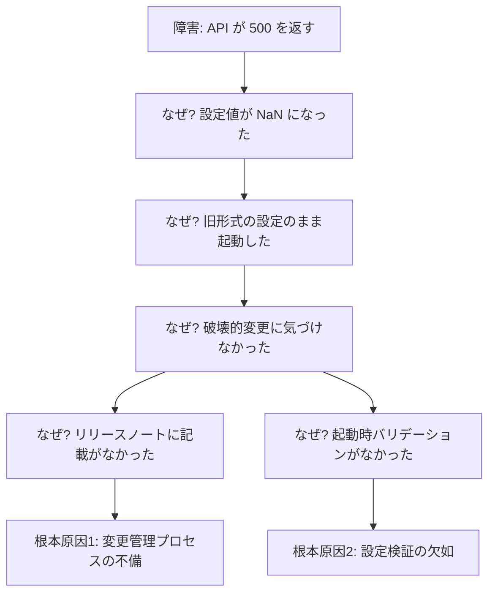

---
# 障害報告 / ポストモーテム向け
# 特徴: 人ではなく仕組みを責める（Blameless）。事実 → 原因 → 対策の順
theme: default
# 共通のレイアウト / コンポーネント / スタイル（shared/）を読み込む
addons:
  - shared
title: ◯◯ 障害 ポストモーテム
info: |
  ## ◯◯ 障害 ポストモーテム
  障害の振り返りと再発防止策の共有です。
author: Your Name
layout: cover
class: text-center
transition: slide-left
mdc: true
colorSchema: light
aspectRatio: 16/9
canvasWidth: 980
lineNumbers: false
drawings:
  persist: false
fonts:
  sans: Noto Sans JP
  serif: Noto Serif JP
  mono: Fira Code
  weights: '300,400,600,700'
  italic: false
exportFilename: postmortem
---

# ◯◯ 障害 ポストモーテム

2026-01-01 発生 / 影響時間 1 時間 24 分

<p class="abs-br m-6 text-sm opacity-60">
  作成: Your Name / 最終更新: 2026-01-05
</p>

<!--
冒頭で必ず Blameless であることを宣言する。
個人の責任追及の場になると、二度と正直な報告が上がってこなくなる。
-->

---
layout: center
---

<div class="callout-box text-lg">

## この場の目的

- **仕組みの改善**を目的とし、個人の責任は問いません
- 「誰が」ではなく「なぜそれが起こりうる状態だったか」を扱います
- 気づいたことは遠慮なく指摘してください

</div>

---

# サマリ

<dl class="grid grid-cols-4 gap-4 mt-6 text-center">
  <div class="note-box">
    <dt class="text-xs opacity-60">深刻度</dt>
    <dd class="text-2xl font-bold mt-1 text-red-600">SEV-2</dd>
  </div>
  <div class="note-box">
    <dt class="text-xs opacity-60">影響時間</dt>
    <dd class="text-2xl font-bold mt-1">1h24m</dd>
  </div>
  <div class="note-box">
    <dt class="text-xs opacity-60">影響ユーザー</dt>
    <dd class="text-2xl font-bold mt-1">約 3,200</dd>
  </div>
  <div class="note-box">
    <dt class="text-xs opacity-60">検知手段</dt>
    <dd class="text-2xl font-bold mt-1">監視</dd>
  </div>
</dl>

<div class="mt-8">

**何が起きたか**: ◯◯ のデプロイ後、△△ API が 500 を返し続け、□□ 機能が利用できなくなった。

**なぜ起きたか**: 設定値の型変更がリリースノートに記載されておらず、旧形式の設定のまま起動した。

</div>

<!--
サマリだけで全体が伝わる状態にする。
詳細を読まない人が大半なので、ここに情報を集約する。
-->

---

# 影響範囲

<div class="grid grid-cols-2 gap-8 mt-4">

<div>

## ユーザー影響

- ◯◯ 機能: **完全に利用不可**
- △△ 機能: 一部エラー（成功率 62%）
- □□ 機能: 影響なし

</div>

<div>

## 事業影響

| 項目 | 数値 |
| --- | --- |
| 失敗リクエスト | 約 48,000 件 |
| 影響ユーザー数 | 約 3,200 人 |
| 問い合わせ | 17 件 |
| 推定損失 | ◯◯ 万円 |

</div>

</div>

<!--
影響は必ず数字で。「一部のユーザー」では判断できない。
影響が「なかった」範囲も書くと、調査の網羅性が伝わる。
-->

---

# タイムライン

| 時刻 | 出来事 |
| --- | --- |
| 14:02 | ◯◯ v2.3.0 をデプロイ |
| 14:05 | エラー率のアラートが発報 |
| 14:11 | オンコール担当が調査を開始 |
| 14:28 | ◯◯ のデプロイが原因と特定 |
| 14:35 | ロールバックを判断・実行 |
| 14:52 | エラー率が正常値に復帰 |
| 15:26 | 影響ユーザーへの通知を完了 |

<p class="mt-6 text-sm opacity-70">
  検知まで <strong>3 分</strong> / 原因特定まで <strong>26 分</strong> / 復旧まで <strong>50 分</strong>
</p>

<!--
時刻は分単位で正確に。ログとチャットの履歴から起こす。
「検知・特定・復旧」の各所要時間を出すと、次の改善点が見えてくる。
-->

---

# 直接原因

<v-clicks>

- ◯◯ v2.3.0 で設定値 `timeout` の型が `string` から `number` に変更された
- 本番環境の設定は旧形式（`"30s"`）のままだった
- 起動時のバリデーションがなく、リクエスト処理時に初めて例外が発生した

</v-clicks>

<div v-click class="mt-8">

```ts
// v2.2 系: "30s" のような文字列を受け付けていた
timeout: parseDuration(config.timeout)

// v2.3 系: number 前提に変更された（破壊的変更）
timeout: config.timeout * 1000  // "30s" * 1000 => NaN
```

</div>

---

# 根本原因

<div class="mt-4">



</div>

<!--
「なぜ」を 5 回繰り返す。人の不注意に行き着いたら、まだ掘り足りない。
「なぜそのミスが起こりうる仕組みだったか」まで進める。
-->

---

# 対応内容

<div class="grid grid-cols-2 gap-8 mt-4">

<div>

## 暫定対応（実施済み）

- v2.2.4 へロールバック
- 設定値を新形式に修正
- 影響ユーザーへの通知

</div>

<div>

## 恒久対応（予定）

- 起動時の設定バリデーション追加
- 破壊的変更のリリースノート必須化
- カナリアリリースの導入

</div>

</div>

---

# 再発防止アクション

| # | アクション | 担当 | 期限 | 状態 |
| --- | --- | --- | --- | --- |
| 1 | 起動時に設定スキーマを検証する | ◯◯ | 1/20 | 着手済 |
| 2 | 破壊的変更のチェックリストを整備 | △△ | 1/31 | 未着手 |
| 3 | カナリアリリースの仕組みを導入 | □□ | 2/28 | 検討中 |
| 4 | 設定変更を CI で差分検証 | ◯◯ | 2/14 | 未着手 |

<p class="mt-6 note-box text-sm">
  アクションは Issue 化し、期限までに完了したかを次回の定例で確認します
</p>

<!--
アクションが「やる気」で終わらないよう、必ずチケット化して追跡する。
ここが実行されなければポストモーテムをやった意味がない。
-->

---
layout: two-cols
layoutClass: gap-8
---

# うまくいったこと

<v-clicks>

- 監視アラートが 3 分で発報した
- ロールバック手順が整備されていて 7 分で完了した
- 障害対応チャンネルへの集約がスムーズだった

</v-clicks>

::right::

# 改善したいこと

<v-clicks>

- 原因特定に 26 分かかった（ログの検索性）
- ユーザー通知の判断に迷いがあった
- ステージング環境で再現できなかった

</v-clicks>

<!--
うまくいったことを必ず入れる。
既にある強みを認識しないと、改善のたびに壊してしまう。
-->
