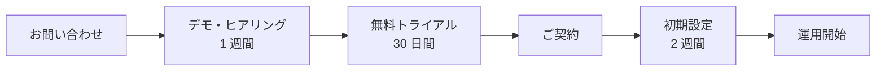

---
# 製品・サービス紹介（営業 / ピッチ）向け
# 特徴: 相手の課題から入る。自社の話は後半まで我慢する
theme: default
# 共通のレイアウト / コンポーネント / スタイル（shared/）を読み込む
addons:
  - shared
title: ◯◯ のご紹介
info: |
  ## ◯◯ のご紹介
  製品・サービス紹介用のスライドです。
author: Your Name
layout: cover
class: text-center
transition: slide-left
mdc: true
colorSchema: light
aspectRatio: 16/9
canvasWidth: 980
lineNumbers: false
drawings:
  persist: false
fonts:
  sans: Noto Sans JP
  serif: Noto Serif JP
  mono: Fira Code
  weights: '300,400,600,700'
  italic: false
exportFilename: product-pitch
---

# ◯◯

△△ を □□ するサービス

  株式会社◯◯ / 2026-01-01

<!--
最初の 1 枚で「何屋か」が伝わること。
社名の由来やビジョンから始めない。相手は自分の課題にしか興味がない。
-->

---
layout: center
class: text-center
---

# こんな課題はありませんか

<ul class="!list-none mt-10 grid grid-cols-3 gap-6 text-left">
  <li v-click class="note-box">
    😥
    
◯◯ の作業に毎月 △△ 時間かかっている

  </li>
  <li v-click class="note-box">
    😰
    
担当者が辞めたら誰も対応できない

  </li>
  <li v-click class="note-box">
    😱
    
ミスが起きても後から気づけない

  </li>
</ul>

<!--
まず相手に「自分ごと」だと思ってもらう。
事前にヒアリングした相手固有の課題に差し替えると効果が跳ね上がる。
-->

---

# 課題の背景

## 市場の変化

<v-clicks>

- ◯◯ の規制強化により対応工数が増加
- 人材採用の難化（有効求人倍率 △△ 倍）
- △△ のスピード要求が年々高まっている

</v-clicks>

## その結果

| 項目 | 業界平均 |
| --- | --- |
| 対応工数 | 月 40 時間 |
| ミス発生率 | 3.2% |
| 属人化率 | 68% |

  出典: ◯◯ 調査（2025 年）n=340

---
layout: center
class: text-center
---

# ◯◯ が解決します

  △△ を自動化し、□□ の工数を 85% 削減

  導入企業 240 社 / 継続率 97%

<!--
ここで初めて自社サービスを出す。
1 行で言い切れないなら、まだ提供価値が絞れていない。
-->

---

# 3 つの特徴

<ol class="!list-none grid grid-cols-3 gap-6 mt-8">
  <li v-click class="note-box">
    01
    <h2 class="!text-base !mb-0 mt-3">すぐ使える</h2>
    
初期設定は 15 分。既存システムの改修は不要です。

  </li>
  <li v-click class="note-box">
    02
    <h2 class="!text-base !mb-0 mt-3">ミスを防ぐ</h2>
    
入力時に自動検証。異常は即座に通知します。

  </li>
  <li v-click class="note-box">
    03
    <h2 class="!text-base !mb-0 mt-3">誰でも運用できる</h2>
    
専門知識は不要。担当者の交代にも耐えます。

  </li>
</ol>

<!--
特徴は 3 つまで。それぞれ「相手にとっての利点」の言葉で書く。
機能名の羅列にならないよう注意する。
-->

---
layout: image-right
image: /images/placeholder.svg
---

# 実際の画面

<v-clicks>

- ダッシュボードで進捗を一覧
- 異常はハイライト表示
- CSV / API での連携に対応

</v-clicks>

  デモ環境をご用意しています。この場でお試しいただけます

<!--
スクリーンショットは実物を使う。モックだと見抜かれる。
可能ならライブデモより録画（GIF）が安全。
-->

---

# 導入事例

<ul class="!list-none grid grid-cols-2 gap-8 mt-4">
  <li class="note-box">
    <figure>
      
製造業 A 社（従業員 500 名）

      
工数 -78%

      <blockquote class="!bg-transparent !text-inherit !border-0 !p-0 mt-3 text-sm">
        月 40 時間かかっていた作業が 9 時間になりました。空いた時間を改善活動に回せています
      </blockquote>
      <figcaption class="mt-2 text-xs opacity-60">— <cite class="not-italic">情報システム部 部長</cite></figcaption>
    </figure>
  </li>
  <li class="note-box">
    <figure>
      
サービス業 B 社（従業員 120 名）

      
ミス 0 件

      <blockquote class="!bg-transparent !text-inherit !border-0 !p-0 mt-3 text-sm">
        導入から 1 年、報告ミスはゼロです。担当が交代しても問題ありませんでした
      </blockquote>
      <figcaption class="mt-2 text-xs opacity-60">— <cite class="not-italic">管理本部 マネージャー</cite></figcaption>
    </figure>
  </li>
</ul>

<!--
相手と同業種・同規模の事例を選ぶ。
数字と生の声をセットにすると信頼されやすい。
-->

---

# 他サービスとの比較

| | ◯◯（当社） | A 社 | B 社 |
| --- | --- | --- | --- |
| 導入期間 | **2 週間** | 3ヶ月 | 1ヶ月 |
| 既存システム改修 | **不要** | 必要 | 一部必要 |
| 初期費用 | **0 円** | 200 万円 | 50 万円 |
| サポート | **平日 9-18 時** | メールのみ | 平日 10-17 時 |

  ※ 2026 年 1 月時点、各社公開情報より当社調べ

<!--
比較表は自社が全部○になると逆に信用されない。
不利な項目も 1 つ入れ、その理由を説明できるようにしておく。
-->

---

# 料金プラン

<ul class="!list-none grid grid-cols-3 gap-6 mt-8">
  <li class="note-box">
    <dl>
      <dt class="font-bold">Starter</dt>
      <dd class="mt-3 text-3xl font-bold">¥30,000/月</dd>
      <dd class="mt-4 text-sm opacity-80">〜10 ユーザー 基本機能</dd>
    </dl>
  </li>
  <li class="note-box border-2 border-brand">
    <dl>
      <dt class="font-bold text-brand">Standard（人気）</dt>
      <dd class="mt-3 text-3xl font-bold">¥80,000/月</dd>
      <dd class="mt-4 text-sm opacity-80">〜50 ユーザー API 連携・優先サポート</dd>
    </dl>
  </li>
  <li class="note-box">
    <dl>
      <dt class="font-bold">Enterprise</dt>
      <dd class="mt-3 text-3xl font-bold">個別見積</dd>
      <dd class="mt-4 text-sm opacity-80">無制限 SSO・専任担当</dd>
    </dl>
  </li>
</ul>

初期費用 0 円 / 30 日間の無料トライアルあり

---

# 導入までの流れ

  お問い合わせから運用開始まで、最短 <strong>6 週間</strong>

---
layout: center
class: text-center
---

# まずは無料トライアルから

30 日間、すべての機能を無料でお試しいただけます

  
📧 sales@example.com

  
📞 03-0000-0000

  
🌐 https://example.com

  本日はありがとうございました

<!--
次のアクションを 1 つに絞る。選択肢が多いと動いてもらえない。
その場で日程を押さえられるとベスト。
-->
