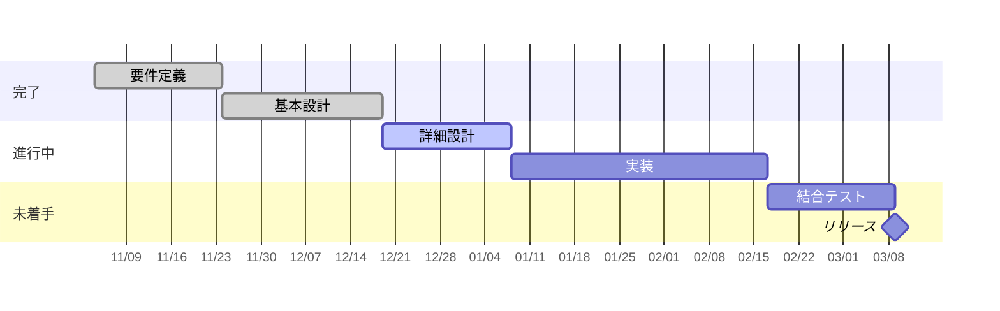

---
# プロジェクト進捗報告（定例会議）向け
# 特徴: 状態を色で即座に伝える。相談事項を明示して会議を前に進める
theme: default
# 共通のレイアウト / コンポーネント / スタイル（shared/）を読み込む
addons:
  - shared
title: ◯◯ プロジェクト 進捗報告
info: |
  ## ◯◯ プロジェクト 進捗報告
  定例会議向けの進捗報告スライドです。
author: Your Name
layout: cover
class: text-center
transition: slide-left
mdc: true
colorSchema: light
aspectRatio: 16/9
canvasWidth: 980
lineNumbers: false
drawings:
  persist: false
fonts:
  sans: Noto Sans JP
  serif: Noto Serif JP
  mono: Fira Code
  weights: '300,400,600,700'
  italic: false
exportFilename: project-report
---

# ◯◯ プロジェクト 進捗報告

第 ◯ 回定例 / 2026-01-01

  報告者: Your Name

<!--
進捗報告は「聞き手が判断・支援するための材料」を出す場。
順調なことのアピールより、詰まっている点の共有を優先する。
-->

---

# サマリ

<dl class="grid grid-cols-3 gap-6 mt-6 text-center">
  

    <dt class="text-sm opacity-60">進捗</dt>
    <dd class="text-3xl font-bold mt-1 text-green-600">順調</dd>
    <dd class="text-xs mt-2 opacity-60">計画比 +2 日</dd>
  

  

    <dt class="text-sm opacity-60">品質</dt>
    <dd class="text-3xl font-bold mt-1 text-amber-500">注意</dd>
    <dd class="text-xs mt-2 opacity-60">未解決バグ 8 件</dd>
  

  

    <dt class="text-sm opacity-60">コスト</dt>
    <dd class="text-3xl font-bold mt-1 text-green-600">順調</dd>
    <dd class="text-xs mt-2 opacity-60">予算消化 42%</dd>
  

</dl>

  <strong>今日の相談事項</strong>: △△ の仕様確定が遅れており、◯月◯日までに決定が必要です

<!--
1 枚目で全体像と相談事項を出す。
色（緑・黄・赤）で状態を示すと、詳細を見なくても伝わる。
-->

---

# マイルストーンの進捗

<!--
「今どこにいるか」が一目でわかるようにする。
遅延がある場合は、その事実と原因・リカバリ案をセットで話す。
-->

---

# 数値指標

| 指標 | 目標 | 前回 | 今回 | 傾向 |
| --- | --- | --- | --- | --- |
| タスク完了率 | 100% | 58% | 72% | ↗ |
| 未解決バグ | 0 件 | 12 件 | 8 件 | ↘ |
| テストカバレッジ | 80% | 64% | 71% | ↗ |
| 予算消化率 | 計画内 | 35% | 42% | → |

  前回との比較を必ず入れる。単発の数字では良し悪しが判断できません

---

# 今期間の実績

## 完了したこと

<v-clicks>

- ◯◯ 機能の詳細設計を完了
- △△ の性能課題を解消（応答 1.2s → 0.3s）
- □□ のレビュー指摘 24 件を反映

</v-clicks>

## 未完了・持ち越し

<v-clicks>

- ◇◇ の仕様確定（△△ 部門との調整待ち）
- ▽▽ のテスト環境構築（インフラ待ち）

</v-clicks>

<!--
未完了を先に言い訳せず出す。持ち越しの理由と、いつ終わるかを添える。
-->

---

# 課題とリスク

| # | 内容 | 影響 | 対応 | 担当 | 期限 |
| --- | --- | --- | --- | --- | --- |
| 1 | △△ の仕様が未確定 | 実装着手が遅れる | 決定会議を設定 | ◯◯ | 1/20 |
| 2 | テスト環境が未整備 | テスト期間が圧縮 | インフラへ依頼済 | △△ | 1/25 |
| 3 | 要員 1 名が長期休暇 | 実装工数 -20% | タスク再配分 | □□ | 対応済 |

  ※ 赤信号のものは太字にし、会議で必ず時間を取る

---

# 次期間のアクション

<v-clicks>

- **◯◯ の実装着手** — 担当: △△ / 期限: 1/31
- **仕様確定会議の実施** — 担当: ◯◯ / 期限: 1/20
- **テスト計画のレビュー** — 担当: □□ / 期限: 1/28

</v-clicks>

  次回定例: <strong>2026-01-15（水）14:00-15:00</strong>

<!--
アクションは必ず「担当」と「期限」をセットにする。
主語のないアクションは実行されない。
-->

---
layout: center
class: text-center
---

# ご相談事項

1. △△ の仕様決定（◯月◯日までにご判断をお願いします）
2. テスト環境の優先度引き上げ
3. ◇◇ の受け入れ基準のすり合わせ

<!--
報告だけで終わらせず、必ず「決めてほしいこと」を出す。
-->
