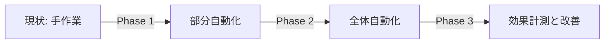
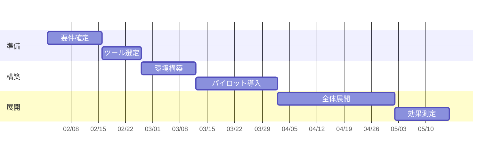

---
# 企画・提案（意思決定を仰ぐ）向け
# 特徴: 結論を最初に。相手に何を判断してほしいかを明示する
theme: default
# 共通のレイアウト / コンポーネント / スタイル（shared/）を読み込む
addons:
  - shared
title: ◯◯ 導入のご提案
info: |
  ## ◯◯ 導入のご提案
  意思決定者向けの提案スライドです。
author: Your Name
layout: cover
class: text-center
transition: slide-left
mdc: true
colorSchema: light
aspectRatio: 16/9
canvasWidth: 980
lineNumbers: false
drawings:
  persist: false
fonts:
  sans: Noto Sans JP
  serif: Noto Serif JP
  mono: Fira Code
  weights: '300,400,600,700'
  italic: false
exportFilename: proposal
---

# ◯◯ 導入のご提案

△△ の課題を □□ で解決する

  2026-01-01 / ◯◯部 Your Name

<!--
提案書の鉄則: 結論 → 根拠 → 詳細の順。
意思決定者は最初の 3 枚しか真剣に見ないと想定して構成する。
-->

---
layout: default
---

# 結論（エグゼクティブサマリ）

  <strong>◯◯ を導入し、△△ の工数を年間 □□ 時間削減することを提案します</strong>

<dl class="grid grid-cols-3 gap-6 mt-10">
  

    <dt class="text-sm opacity-60">必要投資</dt>
    <dd class="text-3xl font-bold mt-1">◯◯ 万円</dd>
  

  

    <dt class="text-sm opacity-60">回収期間</dt>
    <dd class="text-3xl font-bold mt-1">◯ヶ月</dd>
  

  

    <dt class="text-sm opacity-60">開始希望</dt>
    <dd class="text-3xl font-bold mt-1">◯月◯日</dd>
  

</dl>

  ご判断いただきたいこと: 予算 ◯◯ 万円の承認と、△△ チームからの ◯ 名アサイン

<!--
このスライドだけで提案の全体像が伝わる状態にする。
「いくらかかって、いつ回収できて、何を決めてほしいか」を必ず書く。
-->

---

# 現状の課題

<v-clicks>

- **課題 1**: ◯◯ の作業に月 △△ 時間を費やしている
- **課題 2**: 手作業に起因する差し戻しが月 □□ 件発生している
- **課題 3**: 担当者が 1 名に集中し、業務継続リスクがある

</v-clicks>

  出典: ◯◯ の稼働ログ（2025 年 10 月〜12 月）、△△ チームへのヒアリング（n=12）

<!--
課題は必ず数字と出典をセットにする。
「なんとなく非効率」では予算は下りない。
-->

---

# 課題を放置した場合の影響

## 金額換算

| 項目 | 年間コスト |
| --- | --- |
| 手作業の人件費 | ◯◯ 万円 |
| 差し戻し対応 | △△ 万円 |
| 障害対応 | □□ 万円 |
| **合計** | **◯◯◯ 万円** |

## 定性的な影響

<v-clicks>

- 新機能の開発速度が上がらない
- メンバーの離職リスクが高まる
- 顧客からの信頼を損なう

</v-clicks>

<!--
「やらない場合のコスト」を示すのが提案の肝。
現状維持もタダではないことを可視化する。
-->

---

# 提案内容

<v-clicks>

1. **◯◯ を導入する** — △△ の作業を自動化する
2. **□□ の運用ルールを整備する** — 属人化を解消する
3. **◇◇ で効果を計測する** — 導入後の改善を継続する

</v-clicks>

<!--
提案は 3 点に絞る。4 つ以上は覚えてもらえない。
-->

---

# 期待効果

## Before

- 作業時間: 月 **40 時間**
- 差し戻し: 月 **12 件**
- 対応可能者: **1 名**

## After（6ヶ月後）

- 作業時間: 月 **6 時間**
- 差し戻し: 月 **1 件**
- 対応可能者: **5 名**

  年間 <strong>◯◯◯ 万円</strong> のコスト削減、投資回収まで <strong>◯ヶ月</strong>

<!--
Before/After は同じ指標で並べる。指標がずれると比較にならない。
効果は控えめに見積もる。過大な約束は信頼を失う。
-->

---

# 実施計画

<!--
スケジュールは「いつ意思決定が必要か」が読み取れるようにする。
バッファを明示しておくと信頼される。
-->

---

# 体制と費用

## 体制

| 役割 | 担当 | 稼働 |
| --- | --- | --- |
| 責任者 | ◯◯ | 10% |
| 開発 | △△ | 50% |
| 運用 | □□ | 20% |

## 費用

| 項目 | 金額 |
| --- | --- |
| ライセンス | ◯◯ 万円/年 |
| 構築費 | △△ 万円 |
| 教育費 | □□ 万円 |
| **合計** | **◯◯◯ 万円** |

---

# リスクと対応策

| リスク | 影響度 | 対応策 |
| --- | --- | --- |
| 想定より導入が進まない | 中 | パイロットで 1 チーム先行、効果を確認してから展開 |
| 既存システムとの不整合 | 高 | 事前に PoC を実施（◯月まで） |
| 担当者の稼働が確保できない | 中 | 外部支援の利用を並行検討 |

<!--
リスクを自分から出すことで提案の信頼性が上がる。
「対応策まで考えてある」ことを示すのが目的。
-->

---
layout: center
class: text-center
---

# ご判断いただきたいこと

1. 予算 **◯◯◯ 万円** の承認
2. △△ チームからの **◯ 名** のアサイン
3. **◯月◯日** からの着手

  ご質問・ご懸念があればこの場でお伺いします

<!--
最後は必ず「決めてほしいこと」で締める。
ここが曖昧だと会議が持ち帰りになる。
-->

---
layout: section-divider
number: "＋"
---

# Appendix

補足資料

---

# 補足: 他社事例・比較検討

| 選択肢 | 初期費用 | 運用負荷 | 評価 |
| --- | --- | --- | --- |
| A 案（提案） | ◯◯ 万円 | 低 | ◎ |
| B 案 | △△ 万円 | 中 | ○ |
| 現状維持 | 0 円 | 高 | × |

  質疑で聞かれそうな内容は Appendix に置いておき、必要なときだけ表示します

