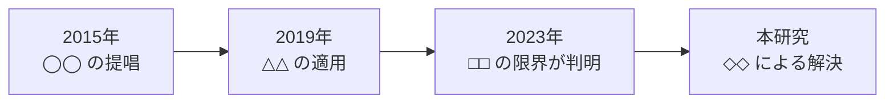

---
# 研究発表 / 調査報告向け
# 特徴: 背景 → 問い → 手法 → 結果 → 考察。主張と事実を明確に分ける
theme: seriph
# 共通のレイアウト / コンポーネント / スタイル（shared/）を読み込む
addons:
  - shared
title: ◯◯ に関する研究
info: |
  ## ◯◯ に関する研究
  研究発表・調査報告用のスライドです。
author: Your Name
layout: cover
class: text-center
transition: slide-left
mdc: true
colorSchema: light
aspectRatio: 16/9
canvasWidth: 980
lineNumbers: false
drawings:
  persist: false
fonts:
  sans: Noto Sans JP
  serif: Noto Serif JP
  mono: Fira Code
  weights: '300,400,600,700'
  italic: false
exportFilename: research
---

# ◯◯ における △△ の効果

□□ を用いた実証分析

  Your Name1, 共著者名2

  1◯◯大学 △△研究科 / 2□□研究所

  第 ◯ 回 △△ 学会 / 2026-01-01

<!--
【15 分発表 + 5 分質疑を想定】
タイトルは「何を対象に、何を明らかにしたか」がわかる形にする。
-->

---

# 発表の概要

  <strong>主張</strong>: ◯◯ において △△ を導入すると、□□ が有意に改善する

<dl class="grid grid-cols-3 gap-6 mt-10">
  

    <dt class="text-sm opacity-60">対象</dt>
    <dd class="mt-2">◯◯ 240 件</dd>
  

  

    <dt class="text-sm opacity-60">手法</dt>
    <dd class="mt-2">△△ による比較実験</dd>
  

  

    <dt class="text-sm opacity-60">主な結果</dt>
    <dd class="mt-2">□□ が 18.4% 向上 (p &lt; 0.01)</dd>
  

</dl>

<!--
冒頭で結論を出す。学会発表でも「最後まで聞かないとわからない」構成は不親切。
-->

---

# 背景

<v-clicks>

- ◯◯ の分野では、△△ が重要な課題とされてきた [1]
- 従来は □□ による手法が主流であった [2, 3]
- しかし ◇◇ の状況では十分な性能が得られないことが報告されている [4]

</v-clicks>

<!--
【2 分】先行研究の流れを時系列で見せると、本研究の位置づけが伝わりやすい。
-->

---

# 関連研究と本研究の位置づけ

| 研究 | 手法 | 対象 | 限界 |
| --- | --- | --- | --- |
| Smith et al. (2019) [2] | ◯◯ | 小規模 | 大規模データで劣化 |
| 田中ら (2021) [3] | △△ | 中規模 | □□ を仮定している |
| Lee et al. (2023) [4] | ◇◇ | 大規模 | 計算コストが高い |
| **本研究** | **▽▽** | **大規模** | **—** |

  本研究の新規性: 計算コストを抑えつつ、□□ の仮定なしに大規模データへ適用できる点

<!--
【2 分】表の最終行に自分の研究を置くと、差分が一目でわかる。
「新規性」は必ず言語化して 1 行で述べる。
-->

---
layout: center
class: text-center
---

# リサーチクエスチョン

**RQ1**: ▽▽ は □□ の仮定なしに △△ を達成できるか

**RQ2**: ▽▽ の計算コストは既存手法と比べてどうか

**RQ3**: ▽▽ はどのような条件で有効性を失うか

<!--
【1 分】RQ は 3 つまで。ここで示した問いに、結果のパートで必ず 1 対 1 で答える。
-->

---

# 提案手法

## 概要

<v-clicks>

1. ◯◯ を △△ で正規化する
2. □□ を用いて重みを推定する
3. ◇◇ により最適化を行う

</v-clicks>

## 定式化

目的関数を以下で定義する。

$$
\begin{aligned}
\mathcal{L}(\theta) &= \frac{1}{N}\sum_{i=1}^{N} \ell\bigl(f_\theta(x_i), y_i\bigr) \\
                     &\quad + \lambda \lVert \theta \rVert_2^2
\end{aligned}
$$

制約条件:

$$
\sum_{j} w_j = 1, \quad w_j \geq 0
$$

<!--
【3 分】数式は 2 つまで。記号の意味は必ず口頭で説明する。
詳細な導出は Appendix に置く。
-->

---

# 実験設定

## データセット

| 名称 | 件数 | 期間 |
| --- | --- | --- |
| Dataset A | 12,400 | 2020-2022 |
| Dataset B | 8,900 | 2021-2023 |
| Dataset C | 45,000 | 2019-2024 |

## 比較手法と評価指標

- **比較手法**: ◯◯ [2], △△ [3], □□ [4]
- **評価指標**: 精度、F1、実行時間
- **交差検証**: 5-fold、5 回試行の平均
- **有意差検定**: Wilcoxon 符号順位検定

  実行環境: CPU ◯◯ / GPU △△ / 実装は Python 3.11

<!--
【2 分】再現性に関わる情報を漏らさない。
コードとデータの公開先があれば必ず示す。
-->

---

# 結果 1: 精度

| 手法 | Dataset A | Dataset B | Dataset C |
| --- | --- | --- | --- |
| ◯◯ [2] | 0.712 | 0.688 | 0.654 |
| △△ [3] | 0.745 | 0.721 | 0.702 |
| □□ [4] | 0.768 | 0.750 | 0.731 |
| **提案手法** | **0.834** | **0.812** | **0.796** |

<figure class="mt-6" role="img" aria-label="Dataset C の精度比較。◯◯ 0.654、△△ 0.702、□□ 0.731、提案手法 0.796">
  

    

      
      ◯◯
    

    

      
      △△
    

    

      
      □□
    

    

      
      提案
    

  

</figure>

  <strong>RQ1 への回答</strong>: すべてのデータセットで既存手法を上回った（p &lt; 0.01）

<!--
【3 分】RQ に対応させて結果を述べる。
グラフは 1 枚 1 メッセージ。複数の主張を 1 枚に載せない。
-->

---

# 結果 2: 計算コスト

| 手法 | 学習時間 | 推論時間 |
| --- | --- | --- |
| □□ [4] | 428 分 | 12.4 ms |
| **提案手法** | **96 分** | **8.1 ms** |

<v-clicks>

- 学習時間を **約 1/4** に短縮
- 推論時間も 35% 改善
- メモリ使用量は同等（±5% 以内）

</v-clicks>

  <strong>RQ2 への回答</strong>: 精度を落とさずに計算コストを削減できた

---

# 考察

<v-clicks>

- **なぜ有効だったか**: ◯◯ の正規化により、△△ の偏りが抑えられたためと考えられる
- **限界**: データが □□ 件未満の場合、既存手法との差は有意でなかった
- **適用条件**: ◇◇ が満たされる環境では有効だが、▽▽ の場合は要検証

</v-clicks>

  <strong>RQ3 への回答</strong>: 小規模データおよび ▽▽ の条件下では優位性が確認できなかった

<!--
【2 分】限界を自分から述べる。ここを隠すと質疑で必ず突かれる。
「なぜ効いたか」の説明があると、単なる性能報告から一段上がる。
-->

---
layout: center
class: text-center
---

# 結論

<v-clicks>

- ◯◯ に対する新しい手法 ▽▽ を提案した
- 3 つのデータセットで既存手法を上回る精度を達成した
- 計算コストを約 1/4 に削減した
- 小規模データでの有効性は今後の課題である

</v-clicks>

  コード: https://github.com/your_id/repo

---
layout: section-divider
number: "＋"
---

# Appendix

補足資料

---

# 参考文献

[1] Author, A. et al. "Title of the paper." *Journal Name*, vol. 12, no. 3, pp. 45-67, 2015.

[2] Smith, B. and Jones, C. "Another paper title." In *Proceedings of Conference*, pp. 123-134, 2019.

[3] 田中太郎, 佐藤花子. 「論文のタイトル」. 『学会誌名』, 第 45 巻, 第 2 号, pp. 89-101, 2021.

[4] Lee, D. et al. "Recent advances in the field." *arXiv preprint* arXiv:2301.00000, 2023.

<!--
質疑で参照されることがあるため、Appendix には
「詳細な導出」「追加実験」「パラメータ設定」も入れておくとよい。
-->
