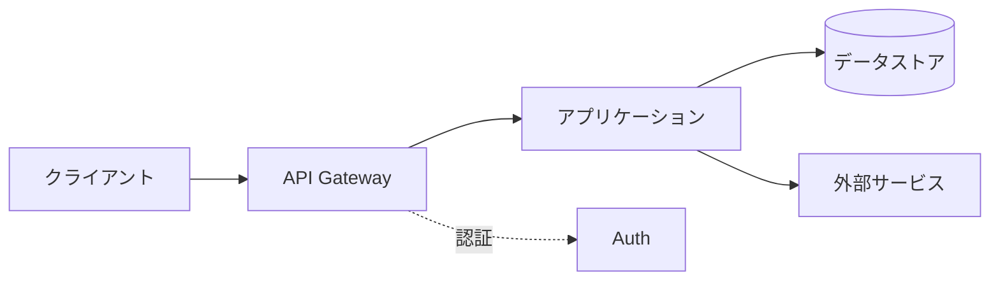

---
# 技術解説 / 社内勉強会（20〜30 分）向け
# 特徴: 背景 → 仕組み → 実践 → まとめ。章立てで迷子にさせない
theme: default
# 共通のレイアウト / コンポーネント / スタイル（shared/）を読み込む
addons:
  - shared
title: 技術トピックのタイトル
info: |
  ## 技術トピックのタイトル
  社内勉強会 / 技術カンファレンス向けの解説スライドです。
author: Your Name
layout: cover
class: text-center
transition: slide-left
mdc: true
colorSchema: light
aspectRatio: 16/9
canvasWidth: 980
lineNumbers: false
drawings:
  persist: false
fonts:
  sans: Noto Sans JP
  serif: Noto Serif JP
  mono: Fira Code
  weights: '300,400,600,700'
  italic: false
exportFilename: tech-talk
---

# 技術トピックのタイトル

〜 サブタイトル：何がわかるようになるか 〜

<p class="abs-br m-6 text-sm opacity-60">
  2026-01-01 / Your Name
</p>

<!--
【所要 25 分想定】章ごとの目安時間を各ノートに記載しています。
-->

---
layout: two-cols
layoutClass: gap-8
---

# 自己紹介

- **名前**: Your Name
- **所属**: ◯◯部 / △△チーム
- **担当**: □□ の設計・開発
- **最近**: ◯◯ を触っています

::right::

<div class="center-box h-full">
  <div class="w-40 h-40 rounded-full bg-brand opacity-20" />
</div>

<!--
【1 分】この話をする資格があることが伝わればよい。
-->

---

# 今日のゴール

<v-clicks>

- ◯◯ が「なぜ必要か」を説明できるようになる
- ◯◯ の基本的な仕組みを図で理解する
- 自分のプロジェクトに導入する第一歩がわかる

</v-clicks>

<p v-click class="mt-8 callout-box">
  <strong>対象</strong>: △△ を触ったことがある方 / □□ の知識は不要です
</p>

<!--
【1 分】ゴールを先に共有すると、聞き手が情報を取捨選択できる。
「対象外のこと」も明示しておくと質疑が締まる。
-->

---

# アジェンダ

<Toc minDepth="1" maxDepth="1" columns="2" />

---
layout: section-divider
number: "01"
---

# 背景と課題

なぜ今この技術なのか

---

# これまでのやり方と、その限界

<div class="grid grid-cols-2 gap-8 mt-6">

<div>

## 従来のアプローチ

- ◯◯ を手動で管理していた
- △△ ごとに個別対応が必要
- スケールすると破綻する

</div>

<div>

## 何が問題か

<v-clicks>

- 変更のたびに全体を確認する必要がある
- 属人化してレビューが機能しない
- 障害の原因究明に時間がかかる

</v-clicks>

</div>

</div>

<!--
【3 分】聞き手が実際に困っている状況に接続する。
自分たちのプロダクトでの具体例を 1 つ出すと刺さる。
-->

---
layout: section-divider
number: "02"
---

# 仕組み

どう動いているのか

---

# 全体アーキテクチャ



<p class="mt-6 note-box">
  ポイント: ◯◯ が △△ を仲介することで、□□ の変更が他に波及しなくなる
</p>

<!--
【4 分】図は 1 枚に情報を詰め込みすぎない。
複雑な図は v-click で段階的に見せるか、複数枚に分割する。
-->

---

# 核となる考え方

<v-clicks>

1. **◯◯ を分離する** — 変更の理由が異なるものを同じ場所に置かない
2. **△△ を宣言的に書く** — 手順ではなく、あるべき状態を記述する
3. **□□ で検証する** — 実行前に矛盾を検出できる

</v-clicks>

<!--
【3 分】原理原則を 3 つに絞る。ここが持ち帰ってもらう中身。
-->

---

# コードで見る

```ts {1-4|6-10|12-15|all}{lines:true}
// 1. 設定を宣言的に定義する
const config = defineConfig({
  target: 'production',
})

// 2. バリデーションは実行前に走る
const result = validate(config)
if (!result.ok)
  throw new ConfigError(result.errors)

// 3. 実行時は決まった手順をなぞるだけ
await run(config, {
  onProgress: p => logger.info(`${p}%`),
})
```

<!--
【4 分】コードは 15 行以内。行ハイライトを使って読む順序を指示する。
実際に動かせるサンプルへのリンクを用意しておくと親切。
-->

---
layout: section-divider
number: "03"
---

# 実践

導入するときに知っておきたいこと

---

# 導入手順

<v-clicks>

1. `npm install ◯◯` で依存を追加する
2. 設定ファイルを 1 つ作る
3. 既存の △△ を置き換える（まずは 1 箇所から）
4. CI に検証ステップを追加する

</v-clicks>

<div v-click>

```bash
$ npm install ◯◯
$ npx ◯◯ init
$ npx ◯◯ check
```

</div>

<!--
【3 分】「まず 1 箇所から」を強調する。全面移行を勧めると腰が重くなる。
-->

---

# ハマりどころ

| 症状 | 原因 | 対処 |
| --- | --- | --- |
| ◯◯ が動かない | △△ の設定漏れ | `config.xxx` を明示する |
| ビルドが遅い | キャッシュ未設定 | CI でキャッシュを有効化 |
| 型エラーが出る | バージョン不整合 | `peerDependencies` を確認 |

<p class="mt-6 callout-box">
  実際に踏んだ罠を共有すると、聞き手の導入コストが大きく下がります
</p>

<!--
【3 分】ここが一番感謝されるパート。自分の失敗を惜しまず出す。
-->

---
layout: center
class: text-center
---

# まとめ

<div class="mt-8 text-left inline-block">

<v-clicks>

- ◯◯ は △△ の課題を □□ で解決する
- 核となる考え方は「分離・宣言・検証」の 3 つ
- 小さく 1 箇所から導入するのが現実的

</v-clicks>

</div>

<!--
【2 分】冒頭のゴールと対応させて締める。
-->

---
layout: center
class: text-center
---

# 参考リンク

<div class="mt-8 text-left inline-block leading-loose">

- 公式ドキュメント: https://example.com/docs
- 今回のサンプルコード: https://github.com/your_id/sample
- 関連記事: https://example.com/blog

</div>

<p class="mt-10 text-2xl">
  ご清聴ありがとうございました
</p>
