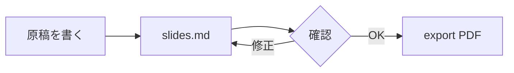

# レイアウトとアニメーション

---
layout: two-cols
layoutClass: gap-8
---

# 2 カラムレイアウト

`layout: two-cols` を指定し、`::right::` で右カラムに切り替えます。

- 左カラムの内容
- 図と説明を並べたいときに便利

::right::

## 右カラム

```ts
const slides = defineSlides({
  theme: 'default',
})
```

<p class="mt-4 p-3 rounded bg-blue-50 text-sm dark:bg-blue-900/30">
  補足やハイライトはこのようなボックスで。
</p>

---
layout: center
class: text-center
---

# 中央寄せレイアウト

`layout: center` は、章の切り替えや一言メッセージに向いています

---

# クリックアニメーション

<v-clicks>

- クリックすると 1 つずつ表示されます
- `<v-clicks>` で囲むと子要素が順番に出ます
- 単体で出したいときは `<v-click>` を使います

</v-clicks>

<v-click>

```ts {1|2-3|all}
// コードブロックも行単位でハイライトを進められる
const total = items.length
const done = items.filter(i => i.done).length
```

</v-click>

<p v-click class="mt-4 text-teal-600 font-bold">
  v-click は任意の HTML 要素に属性として付けられます
</p>

<!--
クリックの順序は `v-click="3"` のように数値で明示指定もできます。
`v-after` を使うと、直前の要素と同じタイミングで表示されます。
-->

---
transition: fade
---

# コードブロック

行のハイライトを `{}` で指定します。`|` 区切りでクリックごとに切り替わります。

```ts {2-3|5-7|all}{lines:true}
export function calculateTotal(items: Item[]): number {
  const subtotal = items.reduce((sum, item) => sum + item.price, 0)
  const tax = Math.floor(subtotal * TAX_RATE)

  if (subtotal >= FREE_SHIPPING_THRESHOLD)
    return subtotal + tax

  return subtotal + tax + SHIPPING_FEE
}
```

外部ファイルの取り込みも可能です（`deck/snippets/external.ts` の region を参照）:

<<< @/snippets/external.ts#greet ts {1-3}

---

# 図とダイアグラム

<div class="grid grid-cols-2 gap-8">

<div>

## Mermaid



</div>

<div>

## 数式（KaTeX）

インライン: $E = mc^2$

$$
\begin{aligned}
\text{score} &= \sum_{i=1}^{n} w_i x_i \\
             &= w^\top x
\end{aligned}
$$

</div>

</div>

---

# Vue コンポーネント

`components/` に置いた `.vue` ファイルは import 不要でそのまま使えます。

<p class="flex justify-center my-8">
  <Counter :count="3" />
</p>

Slidev 組み込みのコンポーネントも利用できます:

- `<Toc />` — 目次
- `<Link to="5">5 枚目へ</Link>` — スライド間リンク
- `<Tweet id="..." />` / `<Youtube id="..." />` — 埋め込み
- `<SlidevVideo>` — 動画の再生制御

---
layout: image-right
image: /images/placeholder.svg
---

# 画像レイアウト

`layout: image-right`（または `image-left`）で、片側に画像を置けます。

画像は `deck/public/` に配置し、`/images/xxx.png` のように絶対パスで参照します。

```md
（区切り線）
layout: image-right
image: /images/screenshot.png
（区切り線）
```

背景画像にしたい場合は `background: /images/bg.jpg` を指定します。
